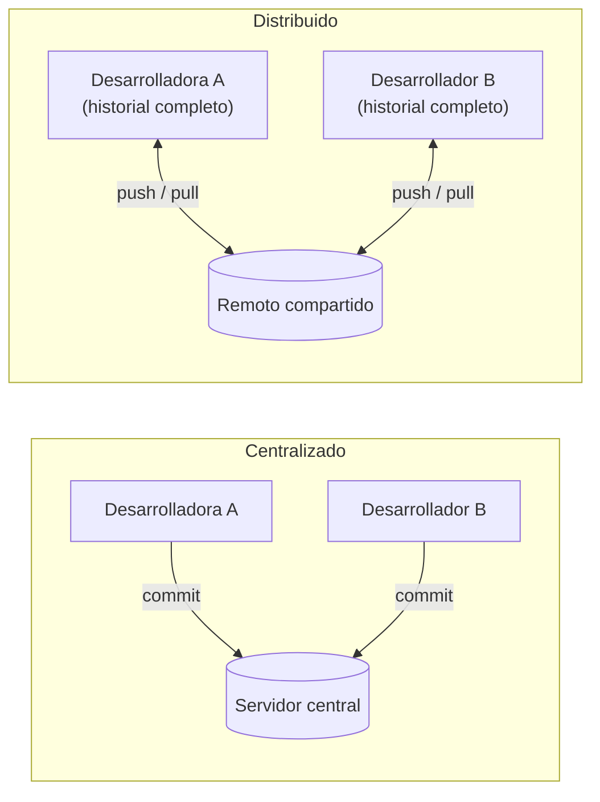
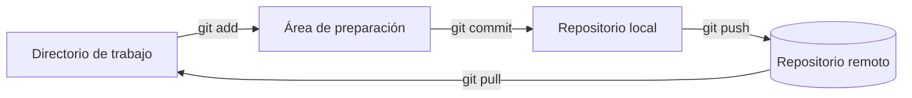

# Qué es Git

**Git** es un *sistema de control de versiones*: una herramienta que registra el
historial de un conjunto de archivos, de modo que cada cambio pueda inspeccionarse,
compartirse y, si hace falta, deshacerse. Es la forma estándar de escribir
software hoy en día, y es la base sobre la que se construyen GitHub, los pull
requests y la integración continua.

Esta página explica de dónde viene Git, qué problema resuelve y el modelo mental
que necesitas antes de aprender ningún comando.

## Un poco de historia

Antes del control de versiones, guardar el historial de un proyecto significaba
copiar carpetas a mano: `proyecto/`, `proyecto-final/`, `proyecto-final-REAL/`.
Eso no escala, es propenso a errores y hace que colaborar sea doloroso.

Git fue creado en **2005** por **Linus Torvalds**, la misma persona que inició el
núcleo de Linux. El núcleo lo desarrollan miles de colaboradores, y la
herramienta que usaban dejó de estar disponible de forma gratuita. Torvalds
necesitaba algo **rápido**, **distribuido** y capaz de manejar un historial
enorme sin ralentizarse. Ninguna herramienta existente encajaba, así que
escribió la suya en unas pocas semanas.

La palabra clave es **distribuido**. En la generación anterior de herramientas
(como Subversion o CVS) había un único servidor central que guardaba *el*
historial; tenías que estar conectado a él para hacer un commit. En Git, **cada
clon de un repositorio es una copia completa de todo el historial**. Puedes
hacer commits, crear ramas, inspeccionar el log y viajar al pasado sin conexión
de red. Compartir con los demás es un paso aparte y explícito.

Hoy Git es, con gran diferencia, el sistema de control de versiones más usado del
mundo, y conocerlo es una habilidad profesional básica.

## Por qué usar control de versiones

Incluso trabajando en solitario, el control de versiones te da tres cosas de las
que cuesta prescindir una vez las tienes:

- **Un historial.** Cada cambio guardado se registra con un autor, una fecha y un
  mensaje. Puedes leer *cómo* y *por qué* el proyecto llegó a su estado actual.
- **Una red de seguridad.** Como cada estado queda almacenado, siempre puedes
  volver a una versión que funcionaba. Experimentar sale barato: prueba algo y,
  si sale mal, descártalo.
- **Colaboración sin pisarse.** Varias personas pueden trabajar sobre los mismos
  archivos a la vez. Git fusiona sus cambios y, cuando dos personas editan las
  mismas líneas, te indica exactamente dónde hace falta una decisión humana.

Para un proyecto en equipo como este, ese último punto es el importante: el
control de versiones es lo que permite que todo el mundo contribuya sin
estorbarse.

## Las tres áreas

Lo más útil que hay que entender antes de tocar ningún comando es que, en un
proyecto Git, un archivo vive en una de **tres áreas**:

| Área | Qué es |
| --- | --- |
| **Directorio de trabajo** | Los archivos reales en tu disco, los que editas. |
| **Área de preparación** (o *staging*, *index*) | Un espacio de borrador donde montas el *próximo* commit. |
| **Repositorio** | El historial permanente y registrado de commits. |

Los cambios fluyen de un área a la siguiente mediante comandos, y una cuarta área
—el **remoto**— es una copia del repositorio compartida con otras personas (aquí
es donde entra GitHub).

Leyendo el diagrama de izquierda a derecha:

1. **Editas** archivos en el directorio de trabajo.
2. `git add` mueve una instantánea de los cambios que quieres conservar al **área
   de preparación**. Esto te permite hacer commit de *parte* de tu trabajo y
   dejar el resto para más tarde.
3. `git commit` registra todo lo preparado como un punto permanente en el
   **repositorio local**, con un mensaje que lo describe.
4. `git push` envía tus commits al **remoto**, para que otros los vean; `git
   pull` trae los commits de otros hasta ti.

!!! tip "¿Para qué sirve el área de preparación?"
    Al principio el área de preparación parece un paso de más, pero es lo que te
    permite elaborar commits limpios: puedes revisar exactamente qué se va a
    registrar y separar cambios no relacionados en commits distintos y con
    sentido, en lugar de un único volcado enorme.

## Adónde ir después

- [Organización](organization.md) — cómo se estructuran realmente los commits, las
  ramas y el historial.
- [Comandos](commands.md) — el conjunto de comandos del día a día, uno a uno.
- [Ejemplo](example.md) — todo el flujo aplicado a este mismo repositorio.
