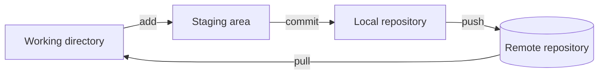

# What is Git

!!! note "Under construction"
    Planned contents are listed below.

## A bit of history

Where Git comes from, the problem it was created to solve, and why distributed
version control replaced the previous generation of tools.

## Why version control

What a developer gains from tracking versions: a readable history, the ability
to go back, and a way for several people to work on the same files without
overwriting each other.

## Git in one picture

A diagram of the three areas a file moves through — working directory, staging
area and repository — plus the remote.

