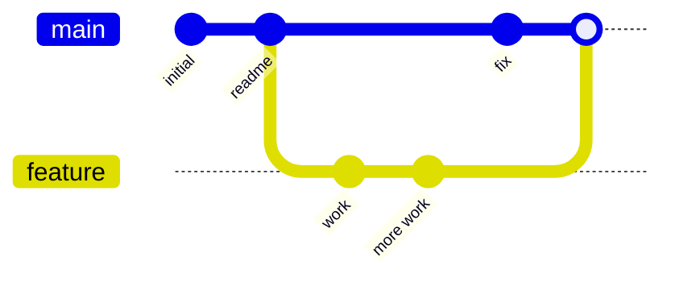

# Organization

!!! note "Under construction"
    Planned contents are listed below.

## Commits as snapshots

What a commit actually stores, and why Git is described as a series of
snapshots rather than a series of differences.

## Diffs

How Git presents the difference between two states, and how to read a diff.

## Branches

What a branch is (a pointer to a commit), how branches diverge, and what
happens on a merge.

## History

How commits chain into a history, and what makes a history easy or hard to
read.
