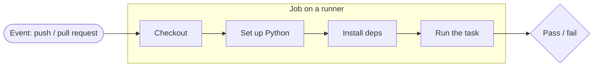

# GitHub Actions

**GitHub Actions** is GitHub's built-in automation: it runs commands on GitHub's
servers whenever something happens in your repository — someone pushes, opens a
pull request, or triggers a run by hand. It is how a project checks itself
automatically instead of relying on everyone to remember.

This page explains the vocabulary, then walks through the **four real workflows**
of this repository as working examples.

## What a workflow is

A **workflow** is a YAML file in `.github/workflows/`. GitHub reads every file in
that folder and runs it when its trigger fires. The pieces you need to know:

- **Event** — *what* triggers the workflow: `push`, `pull_request`, a manual
  `workflow_dispatch`, and so on. Declared under `on:`.
- **Job** — a unit of work that runs on a fresh virtual machine. A workflow can
  have several, running in parallel by default.
- **Runner** — the machine a job runs on, e.g. `runs-on: ubuntu-latest`.
- **Step** — a single command or a reusable **action** (`uses:`) inside a job.
  Steps run in order and share the same machine.



You watch runs in the repository's **Actions** tab. Each run shows its jobs and
steps with a green check or a red cross, and the full log of every command — the
first place to look when a check fails.

!!! info "Reading a status check on a pull request"
    On a pull request, each workflow reports back as a **status check**. Green
    means every step passed; red means something failed and there is a log to
    read. [Repository configuration](repository-configuration.md) shows how to
    make these checks *required* before a merge is allowed.

## The workflows of this repository

This repository runs four workflows, all visible in
[`.github/workflows/`](https://github.com/jparisu/nlp-esperantilo/tree/main/.github/workflows):

| Workflow | File | What it does |
| --- | --- | --- |
| Tests | `tests.yml` | Runs `pytest` via a Python version matrix. |
| Documentation | `docs.yml` | Builds the MkDocs site and publishes it to GitHub Pages from `main`. |
| Documentation preview | `docs-preview.yml` | Builds the site for a pull request and publishes it to a preview URL. |
| Spell check | `spellcheck.yml` | Runs `codespell` over the documentation and the code. |

The next sections look at each one.

## Running Python tests

[`tests.yml`](https://github.com/jparisu/nlp-esperantilo/blob/main/.github/workflows/tests.yml)
runs the test suite on every push and pull request to `main`. Its job follows
the canonical shape — checkout, set up Python, install, test:

```yaml
on:
  push:
    branches: [main]
  pull_request:
    branches: [main]
  workflow_dispatch:          # also runnable by hand from the Actions tab

jobs:
  pytest:
    runs-on: ubuntu-latest
    strategy:
      matrix:
        python-version: ["3.13"]
    steps:
      - uses: actions/checkout@v4
      - uses: actions/setup-python@v5
        with:
          python-version: ${{ matrix.python-version }}
      - run: pip install -e ".[test]"
      - run: pytest
```

Two ideas are worth highlighting:

- **The matrix.** `strategy.matrix` runs the job once per value it lists. Here it
  lists a single version, `3.13`, but adding more — `["3.11", "3.12", "3.13"]` —
  would run the suite on each in parallel, catching version-specific breakage.
  The matrix is the mechanism; the list is a project choice.
- **Installing the package itself.** `pip install -e ".[test]"` installs the
  library *and* its test extra (see
  [Python Library § Organization](../python-library/organization.md)), so the
  tests import it exactly as a user would.

## Rendering and deploying the documentation

[`docs.yml`](https://github.com/jparisu/nlp-esperantilo/blob/main/.github/workflows/docs.yml)
builds this site and publishes it. It runs **only on push to `main`**, because
the public site should reflect merged work, not work in progress:

```yaml
on:
  push:
    branches: [main]

permissions:
  contents: write            # needed to push the built site to gh-pages

jobs:
  deploy:
    steps:
      - uses: actions/checkout@v4
      - uses: actions/setup-python@v5
        with:
          python-version: "3.11"
      - run: pip install -r docs/requirements.txt
      - run: mkdocs build --strict --site-dir site
      - uses: JamesIves/github-pages-deploy-action@v4
        with:
          folder: site
          branch: gh-pages
          clean-exclude: pr-preview/
```

- **`mkdocs build --strict`** turns warnings — a broken link, a missing file —
  into errors, so a mistake fails the build instead of shipping quietly. (This
  is the same command you should run locally before pushing.)
- **`permissions: contents: write`** — a workflow that *writes* to the repository
  (here, pushing the built site to the `gh-pages` branch) needs write
  permission; the default is read-only.
- **`clean-exclude: pr-preview/`** — publishing the real site must not delete the
  pull-request previews that live in the same branch. This links directly to the
  next workflow.

The mechanics of the `gh-pages` branch and the resulting URL are covered in
[GitHub Pages](pages.md).

## Previewing the documentation of a pull request

[`docs-preview.yml`](https://github.com/jparisu/nlp-esperantilo/blob/main/.github/workflows/docs-preview.yml)
gives every pull request its **own published copy** of the site, so a reviewer
can read the rendered documentation before it is merged — without touching the
public site.

It introduces three concepts beyond the basic workflow:

- **The `closed` event.** It triggers on
  `types: [opened, reopened, synchronize, closed]`. The first three (re)build and
  publish the preview; `closed` runs a cleanup that **deletes** the preview when
  the pull request is merged or closed, so previews do not accumulate.
- **Overriding configuration at build time.** It sets a `SITE_URL` environment
  variable so the preview's canonical links and language switcher point at the
  preview, not the production site — the reason [mkdocs.yml](https://github.com/jparisu/nlp-esperantilo/blob/main/mkdocs.yml)
  reads `site_url` from the environment.
- **Forks get no write token.** The deploy step runs only when
  `github.event.pull_request.head.repo.full_name == github.repository` — i.e. the
  pull request comes from a branch of *this* repository. A fork's pull request
  runs with a **read-only token** and cannot publish; its docs are still built
  and checked, it just gets no preview URL.

This build step is also the **pull-request gate**: because it runs
`mkdocs build --strict`, a broken link fails the check before anything is
published. See [GitHub Pages § Previewing a pull request](pages.md#previewing-a-pull-request)
for what the reviewer sees.

## Spell checking

[`spellcheck.yml`](https://github.com/jparisu/nlp-esperantilo/blob/main/.github/workflows/spellcheck.yml)
runs [`codespell`](https://github.com/codespell-project/codespell) over the
documentation and the code on every push and pull request, catching common
typos automatically:

```yaml
- run: pip install codespell
- run: codespell            # configuration comes from .codespellrc
```

The interesting part is teaching the checker about words it does not know —
Esperanto terms, proper names, technical jargon — so they are not reported as
errors. That configuration lives in
[`.codespellrc`](https://github.com/jparisu/nlp-esperantilo/blob/main/.codespellrc):

```ini
[codespell]
skip = ./.git,./.devs,./site,./.venv,...   # paths not to check
ignore-words = .codespell-ignore-words.txt # accepted project vocabulary
builtin = clear,rare                        # only confident corrections
```

Keeping the configuration in a file (rather than in the workflow) means a
**local `codespell` run behaves exactly like CI** — you can catch and fix a typo
before you even push.

!!! tip "Run the checks locally first"
    Every check here is just a command you can run yourself: `pytest`,
    `mkdocs build --strict`, `codespell`. Running them locally before pushing
    turns a red pull request into a green one on the first try.

## Where to go next

- [Repository configuration](repository-configuration.md) — make these checks
  *required* before merging.
- [GitHub Pages](pages.md) — how the documentation build reaches the web.
