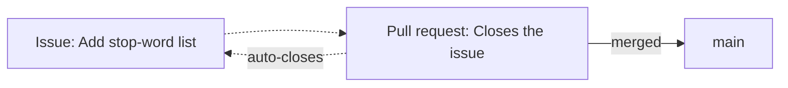

# First steps

This page takes you from *no account* to *a repository of your own on GitHub*,
ready for the [workflow](workflow.md) that follows. If you already have an
account and a repository, you can skim it and jump ahead.

## Create an account

Go to [github.com](https://github.com) and sign up. A free account is enough for
everything in this guide, including private repositories and GitHub Actions.

Two early steps are worth doing well:

- **Your profile.** Use a recognisable username and a real name — on a team
  project, your teammates and instructors need to know who is who. Your commits
  are linked to the email address configured in
  [`git config`](../git/example.md), so use the same email here.
- **Authentication for pushing.** Signing in to the website uses a password;
  pushing from the command line does **not**. You need one of:
    - a **Personal Access Token (PAT)**, used in place of a password over HTTPS,
      or
    - an **SSH key**, a key pair whose public half you add to GitHub.

!!! tip "Which one should I use?"
    For working in notebooks or occasional pushes, a **PAT over HTTPS** is the
    simplest: create it in **Settings → Developer settings → Personal access
    tokens**, and paste it when Git asks for a password. For frequent local
    work, an **SSH key** (added in **Settings → SSH and GPG keys**) avoids
    retyping anything. Either is fine — pick one and move on.

## Create a repository

Click **New** (the green button on your repositories page) and fill in:

- **Name** — short and descriptive, e.g. `nlp-esperantilo`.
- **Visibility** — **public** (anyone can see it) or **private** (only you and
  invited collaborators). You can change this later.
- **Initialise with** — GitHub can add three files for you at creation time:
    - a **README**, the front page of the repository;
    - a **`.gitignore`**, pre-filled for a language of your choice (pick
      *Python*);
    - a **licence**, which states how others may use your code.

!!! note "README, .gitignore and licence"
    Letting GitHub create these means the repository starts with one commit
    already in it. If instead you built the repository locally (as in the
    [Git example](../git/example.md)), leave these unchecked and push your own
    history up.

## Set it up

A few settings are worth changing early, from the repository's **Settings** tab
and its main page:

- **Description and topics.** A one-line description and a few topic tags make
  the repository easier to find and understand.
- **Collaborators.** In **Settings → Collaborators**, invite your teammates so
  they can push to branches and review pull requests.
- **Default branch.** Confirm it is called `main`.

Configuration that *enforces* a healthy team workflow — protecting `main`,
requiring reviews and passing checks — is important enough to have its own page:
[Repository configuration](repository-configuration.md). Set that up once the
workflow and Actions are in place.

## Explore

Most of your time on GitHub is spent reading *other people's* repositories.
Every repository has the same tabs, and knowing them makes any project readable:

| Tab | What you find there |
| --- | --- |
| **Code** | The files, the README, the branch selector and the commit history. |
| **Issues** | Reported bugs, tasks and feature requests, open and closed. |
| **Pull requests** | Proposed changes under review, and past merged ones. |
| **Actions** | The automated runs (tests, builds) and whether they passed. |
| **Insights** | Contribution activity, and a picture of how the project moves. |

Browsing a well-run project — reading how its pull requests are described and how
its issues are discussed — is one of the best ways to learn the conventions of
software collaboration.

## Issues and pull requests

These two are the backbone of collaboration on GitHub, and they play different
roles:

- An **issue** describes *something to do or fix*: a bug, a task, a question. It
  is a conversation, not code. Issues are numbered (`#12`) and can be labelled
  and assigned.
- A **pull request** (PR) proposes *an actual change to the code*: "here is a
  branch with commits, please review and merge it." It is also numbered and
  discussed, but it carries a diff.

The two reference each other. A pull request can say *"Closes #12"* in its
description, and when it is merged, GitHub automatically closes issue #12 and
links the two together. This is what ties the *plan* (issues) to the *work*
(pull requests) into a traceable history.

The pull request itself — how to open, describe, review and merge it — is the
subject of the next page.

## Where to go next

- [Workflow](workflow.md) — the full branch → commit → pull request → merge
  cycle.
