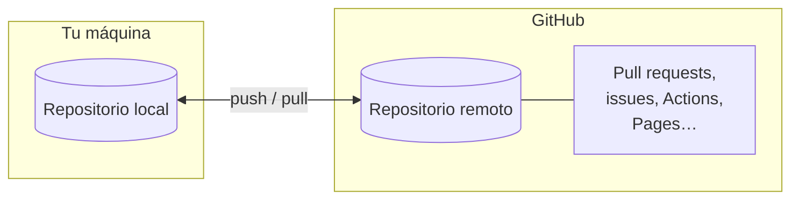

# Qué es GitHub

[Git](../git/index.md) registra el historial de tu proyecto en tu propia máquina.
**GitHub** es un sitio web que aloja repositorios Git en línea y añade encima una
capa de herramientas de colaboración: revisión de código, seguimiento de issues,
automatización y alojamiento web. Es donde vive hoy la mayor parte del software
de código abierto —y una gran parte del software privado—.

Esta página traza la línea entre ambos y explica qué añade la plataforma.

## Git no es GitHub

Esta es la fuente de confusión más común, así que conviene decirlo con claridad:

- **Git** es una *herramienta*. Se ejecuta en tu ordenador, no es propiedad de
  nadie y funciona sin conexión a internet.
- **GitHub** es un *servicio*. Es una empresa (propiedad de Microsoft) que aloja
  repositorios Git y construye funciones a su alrededor.

Puedes usar Git sin tocar nunca GitHub. No puedes usar GitHub sin Git por debajo.
Cuando haces `git push`, GitHub es simplemente un posible **remoto** — una copia
compartida del repositorio a la que también pueden llegar tus compañeros.

!!! tip "El atajo mental"
    Git gestiona *versiones*; GitHub gestiona *la colaboración en torno a esas
    versiones*. Todo en GitHub —un pull request, una revisión, una marca verde—
    es en el fondo una conversación sobre commits y ramas que creó Git.

## Qué añade GitHub

Además del simple alojamiento de Git, GitHub aporta las funciones que hacen
práctico el trabajo en equipo. Las que usa esta guía son:

- **Alojamiento.** Un remoto central, siempre disponible, al que todos pueden
  hacer push y pull — sin servidor que administrar tú mismo.
- **Pull requests.** Una forma estructurada de proponer un cambio: "aquí hay una
  rama, por favor revísala antes de que entre en `main`". Es el corazón del
  [flujo de trabajo](workflow.md).
- **Revisión de código.** Comentarios línea por línea, aprobaciones y peticiones
  de cambios sobre un pull request, para que los cambios los revise otra persona
  antes de entrar.
- **Issues.** Un rastreador de errores, tareas e ideas, cada uno con su propia
  discusión, etiquetas y enlaces a los pull requests que los resuelven.
- **GitHub Actions.** Automatización que se ejecuta en los servidores de GitHub
  cuando ocurre algo — por ejemplo, ejecutar tus pruebas en cada pull request. Se
  cubre en [GitHub Actions](actions.md).
- **GitHub Pages.** Alojamiento gratuito de sitios web estáticos servido
  directamente desde un repositorio — así es como se publica la documentación que
  estás leyendo. Se cubre en [GitHub Pages](pages.md).

Cada una de estas tiene su propia página más adelante en la sección. Este mismo
repositorio, `nlp-esperantilo`, las usa todas, y se referencia a lo largo de la
guía como ejemplo vivo.

## Alternativas

GitHub es la plataforma más popular de su tipo, pero no la única. Las principales
alternativas son:

- **GitLab** — conjunto de funciones muy similar, disponible tanto como servicio
  alojado como en software que puedes ejecutar en tu propio servidor.
- **Bitbucket** — la oferta de Atlassian, a menudo usada junto con Jira.
- **Opciones autoalojadas** (p. ej. **Gitea**, **Forgejo**) — servidores ligeros
  que ejecutas tú mismo.

Lo que importa es que todas envuelven **el mismo Git por debajo**. Los comandos de
la [sección de Git](../git/index.md) funcionan igual con cualquiera de ellas;
solo cambian el sitio web y sus funciones extra. Aprende el flujo de trabajo una
vez y podrás moverte entre plataformas con poca fricción.

## Adónde ir después

- [Primeros pasos](first-steps.md) — crea una cuenta y tu primer repositorio.
- [Flujo de trabajo](workflow.md) — el ciclo diario rama → pull request → merge.
