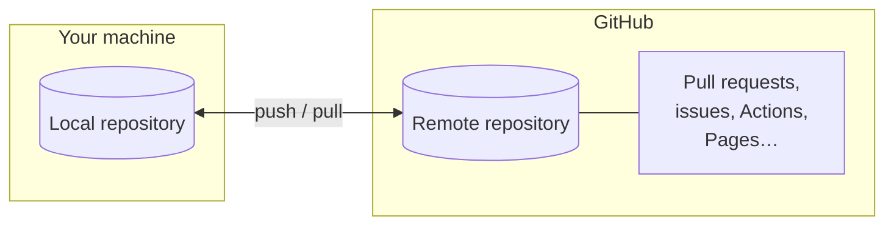

# What is GitHub

[Git](../git/index.md) records the history of your project on your own machine.
**GitHub** is a website that hosts Git repositories online and adds a layer of
collaboration tools on top of them: code review, issue tracking, automation and
web hosting. It is where most open-source software — and a large share of
private software — lives today.

This page draws the line between the two, and explains what the platform adds.

## Git is not GitHub

This is the single most common source of confusion, so it is worth stating
plainly:

- **Git** is a *tool*. It runs on your computer, it is not owned by anyone, and
  it works with no internet connection.
- **GitHub** is a *service*. It is a company (owned by Microsoft) that hosts Git
  repositories and builds features around them.

You can use Git without ever touching GitHub. You cannot use GitHub without Git
underneath. When you `git push`, GitHub is simply one possible **remote** — a
shared copy of the repository that your teammates can also reach.

!!! tip "The mental shortcut"
    Git manages *versions*; GitHub manages *collaboration around those
    versions*. Everything on GitHub — a pull request, a review, a green check —
    is ultimately a conversation about commits and branches that Git created.

## What GitHub adds

On top of plain Git hosting, GitHub provides the features that make teamwork
practical. The ones this guide uses are:

- **Hosting.** A central, always-available remote everyone can push to and pull
  from — no server to run yourself.
- **Pull requests.** A structured way to propose a change: "here is a branch,
  please review it before it goes into `main`." This is the heart of the
  [workflow](workflow.md).
- **Code review.** Line-by-line comments, approvals and change requests on a
  pull request, so changes are checked by another person before they land.
- **Issues.** A tracker for bugs, tasks and ideas, each with its own discussion,
  labels and links to the pull requests that resolve them.
- **GitHub Actions.** Automation that runs on GitHub's servers when something
  happens — for example, running your tests on every pull request. Covered in
  [GitHub Actions](actions.md).
- **GitHub Pages.** Free static-website hosting served straight from a
  repository — this is how the documentation you are reading is published.
  Covered in [GitHub Pages](pages.md).

Each of these gets its own page later in the section. This very repository,
`nlp-esperantilo`, uses all of them, and is referenced throughout as a live
example.

## Alternatives

GitHub is the most popular platform of its kind, but not the only one. The main
alternatives are:

- **GitLab** — very similar feature set, available both as a hosted service and
  as software you can run on your own server.
- **Bitbucket** — Atlassian's offering, often used alongside Jira.
- **Self-hosted options** (e.g. **Gitea**, **Forgejo**) — lightweight servers
  you run yourself.

What matters is that they all wrap the **same Git underneath**. The commands
from the [Git section](../git/index.md) work identically against any of them;
only the website and its extra features differ. Learn the workflow once, and you
can move between platforms with little friction.

## Where to go next

- [First steps](first-steps.md) — create an account and your first repository.
- [Workflow](workflow.md) — the day-to-day branch → pull request → merge cycle.
