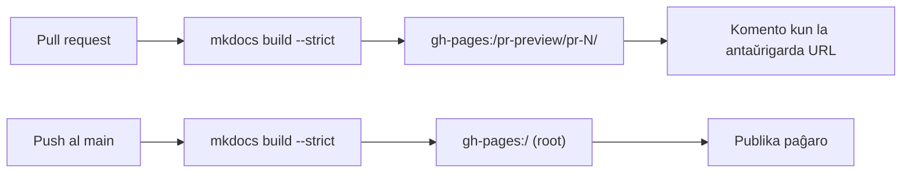

# GitHub Pages

**GitHub Pages** estas senpaga gastigado de statikaj retejoj servata rekte el
deponejo. Tiel publikiĝas la dokumentaro, kiun vi legas nun: la
[MkDocs](../python-library/index.md)-paĝaron konstruas [laborfluo](actions.md) kaj
servas Pages, sen aparta retservilo por prizorgi.

Ĉi tiu paĝo klarigas kio estas Pages, kiel ĝi estas aktivigita, kaj kiel ĉi tiu
deponejo uzas ĝin kaj por la publika paĝaro kaj por antaŭrigardoj po kunfanda peto.

## Kio estas GitHub Pages

Montru Pages al branĉo de via deponejo, kaj GitHub servas la HTML-on en ĝi kiel
publikan retejon ĉe:

```text
https://<uzanto>.github.io/<deponejo>/
```

Por ĉi tiu projekto tio estas
[https://jparisu.github.io/nlp-esperantilo/](https://jparisu.github.io/nlp-esperantilo/).

Pages servas **statikajn** dosierojn — HTML, CSS, JavaScript, bildojn. Ĝi ne rulas
backend-on, kio estas ĝuste la ĝusta afero por dokumentaro: MkDocs transformas la
Markdown-on en `docs/` en dosierujon de statika HTML, kaj Pages servas tiun
dosierujon.

## Aktivigi ĝin

En **Settings → Pages**, metu la fonton al **Deploy from a branch**, elektu la
branĉon **`gh-pages`** kaj la dosierujon **`/ (root)`**.

Vi **ne** kreas nek redaktas tiun branĉon permane. La laborfluoj konstruas la
paĝaron kaj puŝas la rezulton al `gh-pages` por vi; via tasko estas nur verki
Markdown-on en `docs/` sur `main`. La branĉo `gh-pages` estas maŝin-administrata
eligo, ne io al kio homoj faras commit-ojn.

!!! info "Unu branĉo, du celoj"
    Ĉio, kion Pages servas, vivas en la sola branĉo `gh-pages`: la publika paĝaro ĉe
    ĝia radiko, kaj la antaŭrigardoj de kunfandaj petoj en subdosierujoj. La du
    laborfluoj sube atentas neniam superskribi unu la alian.

## Kiel ĉi tiu paĝaro estas disfaldata

Du laborfluoj skribas al la sama branĉo `gh-pages`, al malsamaj lokoj:

| Laborfluo | Ekigilo | Publikigas al | Videbla ĉe |
| --- | --- | --- | --- |
| `docs.yml` | push al `main` | radiko de la branĉo | la publika paĝaro |
| `docs-preview.yml` | kunfanda peto | `pr-preview/pr-<numero>/` | la antaŭrigarda URL publikigita sur la kunfanda peto |



Tiel, la vivociklo de ŝanĝo en la dokumentaro estas: malfermu kunfandan peton →
antaŭrigardo publikiĝas por la reviziantoj → kunfandu → la publika paĝaro ĝisdatiĝas.
Ambaŭ vojoj rulas `mkdocs build --strict`, do rompita ligilo neniam atingas iun el
la du. La mekanikon de la laborfluoj priskribas [GitHub Actions](actions.md).

## Antaŭrigardi kunfandan peton

Ĉiu kunfanda peto ricevas sian propran kopion de la tuta paĝaro, konstruitan el la
branĉo en revizio, ĉe:

```text
https://jparisu.github.io/nlp-esperantilo/pr-preview/pr-<numero>/
```

Bot-komento sur la kunfanda peto ligas al ĝi, kaj la ligilo ĝisdatiĝas ĉe ĉiu push.
La antaŭrigardo foriĝas kiam la kunfanda peto estas kunfandita aŭ fermita.

Du detaloj igas ĉi tion sekura — la publikan paĝaron *neniam* tuŝas antaŭrigardo:

- la produkta disfaldo ruliĝas kun **`clean-exclude: pr-preview/`**, do publikigi la
  realan paĝaron ne forigas la antaŭrigardojn en la subdosierujoj;
- la antaŭrigarda konstruo superskribas **`site_url`**, do ĝiaj kanonaj ligiloj, la
  retmapo kaj la lingva ŝaltilo restas ene de la antaŭrigardo anstataŭ montri al la
  produkto.

Nenio atingas la ĉefpaĝon ĝis la kunfanda peto kunfandiĝas — kio estas tio, kio igas
antaŭrigardon sekura por transdoni al reviziinto.

!!! warning "Kunfandaj petoj de fork-oj"
    La kunfanda peto de fork ruliĝas kun nur-lega ĵetono kaj ne povas publikigi. Ĝia
    dokumentaro tamen konstruiĝas kaj kontroliĝas (do la ligilo-kontrolo plu gardas
    la kunfandon), ĝi nur ne ricevas antaŭrigardan URL-on. Vidu
    [GitHub Actions § Antaŭrigardi la dokumentaron de kunfanda peto](actions.md#antaurigardi-la-dokumentaron-de-kunfanda-peto).

## Publikigi la vian

Por reprodukti ĉi tiun aranĝon en alia deponejo:

1. **Aktivigu Pages** sur branĉo `gh-pages` (**Settings → Pages**), kiel supre.
2. **Permesu al la laborfluoj skribi al la deponejo**, por ke la disfalda paŝo povu
   puŝi al `gh-pages`: **Settings → Actions → General → Workflow permissions → Read
   and write permissions**.
3. **Kopiu la du laborfluojn** —
   [`docs.yml`](https://github.com/jparisu/nlp-esperantilo/blob/main/.github/workflows/docs.yml)
   kaj [`docs-preview.yml`](https://github.com/jparisu/nlp-esperantilo/blob/main/.github/workflows/docs-preview.yml)
   — kaj alĝustigu la URL-ojn al via deponejo.

De tiam, verki dokumentaron estas nur redakti Markdown-on kaj malfermi kunfandan
peton; la publikigo okazas per si mem.

## Kien iri poste

- [Python-Biblioteko](../python-library/index.md) — la alia duono de la projekto: la
  biblioteko, kiun ĉi tiu dokumentaro priskribas kiel konstrui.
