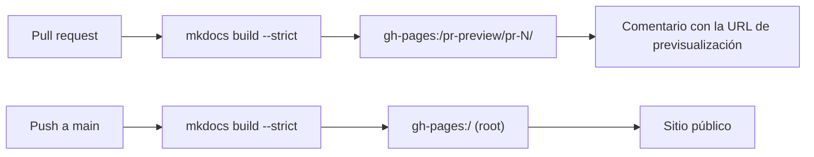

# GitHub Pages

**GitHub Pages** es alojamiento gratuito de sitios web estáticos servido
directamente desde un repositorio. Es la forma en que se publica la documentación
que estás leyendo ahora mismo: el sitio [MkDocs](../python-library/index.md) lo
construye un [workflow](actions.md) y lo sirve Pages, sin ningún servidor web
aparte que mantener.

Esta página explica qué es Pages, cómo se activa y cómo lo usa este repositorio
tanto para el sitio público como para las previsualizaciones por pull request.

## Qué es GitHub Pages

Apunta Pages a una rama de tu repositorio y GitHub sirve el HTML que hay en ella
como un sitio web público en:

```text
https://<usuario>.github.io/<repositorio>/
```

Para este proyecto eso es
[https://jparisu.github.io/nlp-esperantilo/](https://jparisu.github.io/nlp-esperantilo/).

Pages sirve archivos **estáticos** — HTML, CSS, JavaScript, imágenes. No ejecuta
un backend, lo cual es exactamente lo apropiado para documentación: MkDocs
convierte el Markdown de `docs/` en una carpeta de HTML estático, y Pages sirve esa
carpeta.

## Activarlo

En **Settings → Pages**, pon el origen en **Deploy from a branch**, elige la rama
**`gh-pages`** y la carpeta **`/ (root)`**.

**No** creas ni editas esa rama a mano. Los workflows construyen el sitio y suben
el resultado a `gh-pages` por ti; tu trabajo es solo escribir Markdown en `docs/`
en `main`. La rama `gh-pages` es salida gestionada por la máquina, no algo a lo que
los humanos hagan commit.

!!! info "Una rama, dos propósitos"
    Todo lo que Pages sirve vive en la única rama `gh-pages`: el sitio público en
    su raíz, y las previsualizaciones de pull request en subcarpetas. Los dos
    workflows de abajo tienen cuidado de no sobrescribirse nunca entre sí.

## Cómo se despliega este sitio

Dos workflows escriben en la misma rama `gh-pages`, en ubicaciones distintas:

| Workflow | Desencadenante | Publica en | Visible en |
| --- | --- | --- | --- |
| `docs.yml` | push a `main` | raíz de la rama | el sitio público |
| `docs-preview.yml` | pull request | `pr-preview/pr-<número>/` | la URL de previsualización publicada en el pull request |



Así, el ciclo de vida de un cambio en la documentación es: abrir un pull request →
se publica una previsualización para quienes revisan → fusionar → el sitio público
se actualiza. Ambos caminos ejecutan `mkdocs build --strict`, de modo que un
enlace roto nunca llega a ninguno de los dos. Los mecanismos del workflow se
describen en [GitHub Actions](actions.md).

## Previsualizar un pull request

Cada pull request obtiene su propia copia de todo el sitio, construida desde la
rama en revisión, en:

```text
https://jparisu.github.io/nlp-esperantilo/pr-preview/pr-<número>/
```

Un comentario de bot en el pull request enlaza a ella, y el enlace se actualiza en
cada push. La previsualización se borra cuando el pull request se fusiona o se
cierra.

Dos detalles hacen que esto sea seguro — el sitio público *nunca* lo toca una
previsualización:

- el despliegue de producción se ejecuta con **`clean-exclude: pr-preview/`**, de
  modo que publicar el sitio real no borra las previsualizaciones que están en las
  subcarpetas;
- la construcción de la previsualización sobrescribe **`site_url`**, de modo que
  sus enlaces canónicos, su sitemap y su selector de idioma se quedan dentro de la
  previsualización en lugar de apuntar a producción.

Nada llega a la portada hasta que el pull request se fusiona — que es lo que hace
que una previsualización sea segura para entregársela a quien revisa.

!!! warning "Pull requests desde forks"
    El pull request de un fork se ejecuta con un token de solo lectura y no puede
    publicar. Su documentación igualmente se construye y se comprueba (así que la
    verificación de enlaces sigue actuando de puerta para la fusión), solo que no
    obtiene URL de previsualización. Véase
    [GitHub Actions § Previsualizar la documentación de un pull request](actions.md#previsualizar-la-documentacion-de-un-pull-request).

## Publicar la tuya

Para reproducir esta configuración en otro repositorio:

1. **Activa Pages** en una rama `gh-pages` (**Settings → Pages**), como arriba.
2. **Permite que los workflows escriban en el repositorio**, para que el paso de
   despliegue pueda hacer push a `gh-pages`: **Settings → Actions → General →
   Workflow permissions → Read and write permissions**.
3. **Copia los dos workflows** — [`docs.yml`](https://github.com/jparisu/nlp-esperantilo/blob/main/.github/workflows/docs.yml)
   y [`docs-preview.yml`](https://github.com/jparisu/nlp-esperantilo/blob/main/.github/workflows/docs-preview.yml)
   — y ajusta las URLs a tu repositorio.

A partir de ahí, escribir documentación es solo editar Markdown y abrir un pull
request; la publicación ocurre sola.

## Adónde ir después

- [Biblioteca Python](../python-library/index.md) — la otra mitad del proyecto: la
  biblioteca que esta documentación describe cómo construir.
