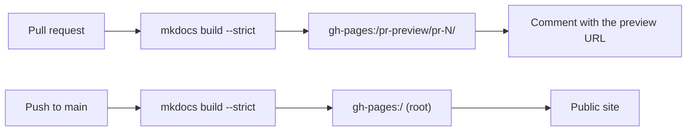

# GitHub Pages

**GitHub Pages** is free static-website hosting served directly from a
repository. It is how the documentation you are reading right now is published:
the [MkDocs](../python-library/index.md) site is built by a
[workflow](actions.md) and served by Pages, with no separate web server to
maintain.

This page explains what Pages is, how it is enabled, and how this repository
uses it both for the public site and for per-pull-request previews.

## What GitHub Pages is

Point Pages at a branch of your repository, and GitHub serves the HTML in it as a
public website at:

```text
https://<user>.github.io/<repository>/
```

For this project that is
[https://jparisu.github.io/nlp-esperantilo/](https://jparisu.github.io/nlp-esperantilo/).

Pages serves **static** files — HTML, CSS, JavaScript, images. It does not run a
backend, which is exactly right for documentation: MkDocs turns the Markdown in
`docs/` into a folder of static HTML, and Pages serves that folder.

## Enabling it

In **Settings → Pages**, set the source to **Deploy from a branch**, choose the
branch **`gh-pages`** and the folder **`/ (root)`**.

You do **not** create or edit that branch by hand. The workflows build the site
and push the result to `gh-pages` for you; your job is only to author Markdown in
`docs/` on `main`. The `gh-pages` branch is machine-managed output, not something
humans commit to.

!!! info "One branch, two purposes"
    Everything Pages serves lives on the single `gh-pages` branch: the public
    site at its root, and the pull-request previews in subfolders. The two
    workflows below are careful never to overwrite each other.

## How this site is deployed

Two workflows write to the same `gh-pages` branch, to different locations:

| Workflow | Trigger | Publishes to | Visible at |
| --- | --- | --- | --- |
| `docs.yml` | push to `main` | branch root | the public site |
| `docs-preview.yml` | pull request | `pr-preview/pr-<number>/` | the preview URL posted on the pull request |



So the lifecycle of a documentation change is: open a pull request → a preview is
published for reviewers → merge → the public site updates. Both paths run
`mkdocs build --strict`, so a broken link never reaches either. The workflow
mechanics are described in [GitHub Actions](actions.md).

## Previewing a pull request

Every pull request gets its own copy of the whole site, built from the branch
under review, at:

```text
https://jparisu.github.io/nlp-esperantilo/pr-preview/pr-<number>/
```

A bot comment on the pull request links to it, and the link updates on every
push. The preview is deleted when the pull request is merged or closed.

Two details make this safe — the public site is *never* touched by a preview:

- the production deployment runs with **`clean-exclude: pr-preview/`**, so
  publishing the real site does not delete the previews sitting in subfolders;
- the preview build overrides **`site_url`**, so its canonical links, sitemap and
  language switcher stay inside the preview instead of pointing at production.

Nothing reaches the front page until the pull request is merged — which is what
makes a preview safe to hand to a reviewer.

!!! warning "Pull requests from forks"
    A fork's pull request runs with a read-only token and cannot publish. Its
    documentation is still built and checked (so the link-check still gates the
    merge), it just gets no preview URL. See
    [GitHub Actions § Previewing the documentation of a pull request](actions.md#previewing-the-documentation-of-a-pull-request).

## Publishing your own

To reproduce this setup in another repository:

1. **Enable Pages** on a `gh-pages` branch (**Settings → Pages**), as above.
2. **Allow workflows to write to the repository**, so the deploy step can push to
   `gh-pages`: **Settings → Actions → General → Workflow permissions → Read and
   write permissions**.
3. **Copy the two workflows** — [`docs.yml`](https://github.com/jparisu/nlp-esperantilo/blob/main/.github/workflows/docs.yml)
   and [`docs-preview.yml`](https://github.com/jparisu/nlp-esperantilo/blob/main/.github/workflows/docs-preview.yml)
   — and adjust the URLs to your repository.

From then on, writing documentation is just editing Markdown and opening a pull
request; publishing happens on its own.

## Where to go next

- [Python Library](../python-library/index.md) — the other half of the project:
  the library this documentation describes how to build.
