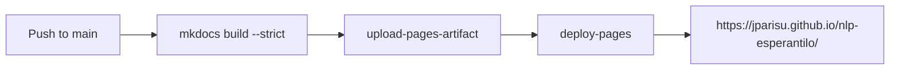

# GitHub Pages

!!! note "Under construction"
    Planned contents are listed below.

## What GitHub Pages is

Free static hosting served directly from a repository, and the URL it produces:
`https://<user>.github.io/<repository>/`.

## Enabling it

In **Settings → Pages**, set the source to **GitHub Actions**. This repository
uses that mode, so no `gh-pages` branch is needed.

## How this site is deployed

The `docs.yml` workflow builds the site with MkDocs and uploads it as a Pages
artifact; a second job deploys that artifact. Only pushes to `main` deploy —
pull requests just build, to catch broken links and bad configuration early.

## Publishing your own

The steps to reproduce this setup in another repository, and the permissions
the workflow needs (`pages: write`, `id-token: write`).
