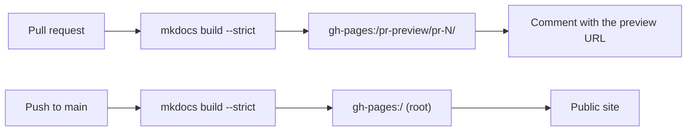

# GitHub Pages

!!! note "Under construction"
    Planned contents are listed below.

## What GitHub Pages is

Free static hosting served directly from a repository, and the URL it produces:
`https://<user>.github.io/<repository>/`.

## Enabling it

In **Settings → Pages**, set the source to **Deploy from a branch**, branch
`gh-pages`, folder `/ (root)`. The workflows create and update that branch;
nothing has to be committed there by hand.

## How this site is deployed

Two workflows write to the same `gh-pages` branch, to different places:

| Workflow | Trigger | Publishes to | Visible at |
| --- | --- | --- | --- |
| `docs.yml` | push to `main` | branch root | the public site |
| `docs-preview.yml` | pull request | `pr-preview/pr-<number>/` | the preview URL posted on the pull request |



## Previewing a pull request

Every pull request gets its own copy of the whole site, built from the branch
under review, at:

```text
https://jparisu.github.io/nlp-esperantilo/pr-preview/pr-<number>/
```

A bot comment on the pull request links to it, and the link updates on every
push. The preview is deleted when the pull request is merged or closed.

Two details make this work without ever touching the public site:

- the production deployment runs with `clean-exclude: pr-preview/`, so
  publishing the real site does not delete the previews;
- the preview build overrides `site_url`, so canonical links and the language
  switcher stay inside the preview.

Nothing reaches the front page until the pull request is merged — that is what
makes a preview safe to hand to a reviewer.

!!! warning "Pull requests from forks"
    A fork's pull request runs with a read-only token and cannot publish. Its
    documentation is still built and checked, it just gets no preview URL.

## Publishing your own

The steps to reproduce this setup in another repository: enable Pages on a
`gh-pages` branch, allow workflows to write to the repository
(**Settings → Actions → General → Workflow permissions**), and copy the two
workflows.
