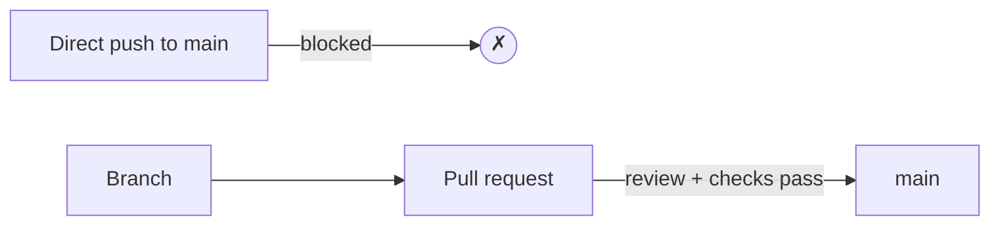

# Repository configuration

The [workflow](workflow.md) and the [Actions](actions.md) only *help* if the team
actually follows them. This page is about making them **enforced**: configuring
the repository so that `main` cannot be broken by accident, and every change goes
through a reviewed, tested pull request.

This matters most in a team, where "please remember to open a pull request" is
not a reliable safeguard.

!!! info "Order matters"
    Protecting `main` only makes sense once branches, pull requests and CI checks
    exist — which is why this page comes after [Workflow](workflow.md) and
    [GitHub Actions](actions.md). Set the rules up once those are in place.

## Branch protection and rulesets

By default, anyone with write access can push straight to `main`. A **ruleset**
(the modern replacement for classic *branch protection rules*) locks that down.
In **Settings → Rules → Rulesets → New branch ruleset**, target the `main` branch
and enable, at minimum:

- **Restrict deletions** and **Block force pushes** — `main`'s history cannot be
  deleted or rewritten.
- **Require a pull request before merging** — no direct pushes to `main`; every
  change arrives as a pull request.

With just these two, `main` is safe from accidental direct commits, and the
[workflow](workflow.md) becomes the *only* way in.

## Required reviews

Inside the "Require a pull request" rule, set **Require approvals** to at least
**1**. Now a pull request cannot be merged until a teammate has reviewed and
approved it — the four-eyes principle, enforced.

Two related options are worth knowing:

- **Dismiss stale approvals when new commits are pushed.** If the author pushes
  more changes after an approval, the approval is cleared and the reviewer must
  look again — so nobody merges code that was never actually reviewed.
- **Require review from Code Owners.** If you add a `CODEOWNERS` file, changes to
  certain paths must be approved by their designated owner.

## Required status checks

This is where the [Actions](actions.md) come in. Enable **Require status checks
to pass before merging**, then select the checks that must be green — for this
repository, the **tests**, the **spell check** and the **documentation build**.

A pull request whose checks are red can then no longer be merged, no matter who
approves it. Automated quality gates and human review reinforce each other:

- the machine catches what humans miss (a failing test, a typo, a broken link);
- the human catches what machines miss (bad design, unclear code, wrong
  approach).

!!! tip "Also require the branch to be up to date"
    The option **Require branches to be up to date before merging** forces a pull
    request to include the latest `main` before it can merge, so the checks ran
    against what will actually land — not against a stale base.

## Other useful settings

A few more settings keep the repository tidy, mostly under **Settings → General**
and the ruleset:

- **Automatically delete head branches.** After a pull request is merged, its
  branch is removed — no manual cleanup, no clutter of dead branches.
- **Require linear history.** Forbids merge commits on `main`, keeping the
  history a straight line (pairs well with *squash* merges).
- **Require conversation resolution before merging.** Every review comment must
  be marked resolved before the merge button unlocks, so no feedback is silently
  dropped.

## Good practices

Configuration enforces rules, but a healthy project also depends on habits the
settings cannot check:

- **Pull requests with well-written commits.** Small, atomic commits with clear
  messages (see [Workflow § Commit best practices](workflow.md#commit-best-practices))
  make review fast and the history readable.
- **Green before review.** Get the checks passing before you ask a teammate to
  review — do not spend their time on something CI would have caught.
- **Balanced contribution.** On a team assignment, everyone should open pull
  requests and everyone should review them. The **Insights → Contributors** page
  makes the balance (or imbalance) visible.
- **Review kindly and concretely.** Comment on the code, not the person; suggest,
  do not just reject.

Together, the enforced rules and these habits are what let a team move quickly
*without* breaking `main` or stepping on each other's work.

## Where to go next

- [GitHub Pages](pages.md) — publishing the documentation from the repository.
