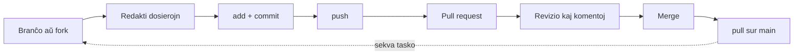

# Laborfluo

Ĉi tiu estas la paĝo, kiun oni devas enprofundigi. Preskaŭ la tuta ĉiutaga laboro en
kunhavigita projekto sekvas la saman ciklon: **komencu de branĉo, konfirmu vian
laboron, puŝu ĝin, malfermu kunfandan peton, revizigu ĝin, kaj kunfandu ĝin.** Ĉio
alia en ĉi tiu sekcio subtenas ĉi tiun ciklon.



## Branĉo aŭ fork

Estas du manieroj akiri vian propran kopion por labori, depende de ĉu vi povas
skribi al la deponejo:

- **Vi havas skriban aliron** (via deponejo aŭ tiu de via teamo) → kreu **branĉon**.
  Ĉiuj laboras en la sama deponejo, sur apartaj branĉoj el `main`. Ĉi tiu estas la
  normala kazo por teama projekto.

    ```console
    $ git checkout main
    $ git pull                       # komencu de la plej lasta main
    $ git checkout -b add-stop-words # via branĉo por ĉi tiu tasko
    ```

- **Vi ne havas skriban aliron** (la publika deponejo de alia persono) → faru
  **fork** de ĝi. Fork estas via persona kopio de la tuta deponejo sub via konto. Vi
  branĉigas kaj konfirmas tie, kaj poste malfermas kunfandan peton *reen al la
  originalo*.

!!! tip "Nomu vian branĉon laŭ ĝia tasko"
    Branĉa nomo kiel `add-stop-words` aŭ `fix-tokenizer-accents` diras al ĉiuj por
    kio ĝi estas per unu rigardo. Evitu `patch-1` aŭ `test`.

## Bonaj praktikoj de commit-oj

La [Git-sekcio](../git/organization.md#historio) prezentis *kial* gravas pura
historio; jen *kiel* produkti ĝin. Bona commit estas:

- **Atoma** — unu kohera ŝanĝo por ĉiu commit. "Add stop-word list" kaj "Fix typo in
  README" estas du commit-oj, ne unu.
- **Bone priskribita** — la mesaĝo diras kion faras la commit, en imperativo:
  `Add accusative handling to the tokenizer`, ne `changes` aŭ `wip`.
- **Memstara** — la projekto devus plu funkcii post ĉiu commit, por ke ajna commit
  estu reviziebla aŭ malfarebla memstare.

Vaste uzata konvencio estas **Conventional Commits**, kiu antaŭmetas al la mesaĝo
tipon:

```text
feat: add stop-word filtering to the tokenizer
fix: handle words ending in -ĉ correctly
docs: write the Git section of the guide
test: cover the plural suffix -j
```

Adopti konvencion estas nedeviga, sed ĝi igas la historion facile trarigardebla kaj
eĉ povas movi aŭtomatigon poste. Kio plej gravas estas la **konsekvenceco ene de la
teamo**.

## Subskribado de commit-oj

Iu ajn povas meti kion ajn en `user.name` kaj `user.email`, do defaŭlte la aŭtoro de
commit estas nur nekonfirmita teksto. **Subskribi** commit-on aldonas al ĝi
kriptografian subskribon, kiu pruvas ke ĝi vere venis de vi; GitHub tiam montras
verdan insignon **`Verified`** apud ĝi.

Vi subskribas per ŝlosilo, kiun GitHub konas — aŭ **GPG** aŭ, pli simple, la
**SSH-ŝlosilo**, kiun vi eble jam uzas por puŝi:

```console
$ git config --global gpg.format ssh
$ git config --global user.signingkey ~/.ssh/id_ed25519.pub
$ git config --global commit.gpgsign true   # subskribu ĉiun commit-on aŭtomate
```

Poste aldonu tiun ŝlosilon duan fojon en GitHub, kiel **Signing Key**, en
**Settings → SSH and GPG keys**.

!!! note "Ĉu subskribado estas deviga?"
    Por ĉi tiu projekto, subskribado estas *bone-havinda*, ne strikta postulo.
    Komprenu kion signifas la insigno `Verified` kaj kiel ĝin aktivigi; teamo povas
    poste decidi ĉu postuli ĝin (vidu
    [Agordo de la deponejo](repository-configuration.md)).

## Kunfanda peto

Post puŝo de via branĉo, malfermu **kunfandan peton** (PR) por proponi kunfandi ĝin
en `main`. En GitHub, puŝi novan branĉon montras butonon **"Compare & pull
request"**; de la komandolinio, la eligo de la push presas ligilon, kiu malfermas la
saman formularon.

Bona kunfanda peto:

- havas **klaran titolon** kaj **priskribon** de kio ŝanĝiĝis kaj kial;
- **ligas la problemon**, kiun ĝi solvas, per `Closes #12`, por ke la problemo
  fermiĝu aŭtomate ĉe la kunfando (vidu [Unuaj paŝoj](first-steps.md#problemoj-kaj-kunfandaj-petoj));
- estas **sufiĉe malgranda por revizio** — fokusa PR ricevas pli bonan revizion ol
  grandega.

Malfermi la PR-on estas tio, kio ekigas la aŭtomatajn kontrolojn
([GitHub Actions](actions.md)): la testoj, la ortografia kontrolo kaj la
antaŭrigardo de la dokumentaro ĉiuj ruliĝas sur via branĉo kaj raportas reen sur la
PR.

## Revizio kaj kunfando

Kunfanda peto estas **konversacio**, ne formalaĵo:

1. Teamano **revizias** la diff-on, lasante komentojn sur specifaj linioj kaj aŭ
   **aprobante** aŭ **petante ŝanĝojn**.
2. Vi respondas puŝante pliajn commit-ojn al la sama branĉo —la PR ĝisdatiĝas
   aŭtomate— ĝis la reviziinto estas kontenta kaj la kontroloj estas verdaj.
3. La PR estas **kunfandita** en `main`, kutime per la butono **"Squash and merge"**
   aŭ **"Merge"**.

Post la kunfando, revenigu la ŝanĝon al via loka `main` kaj forigu la finitan
branĉon:

```console
$ git checkout main
$ git pull                       # main nun inkluzivas la kunfanditan laboron
$ git branch -d add-stop-words   # ordigo
```

Kaj la ciklo rekomenciĝas kun la sekva tasko.

!!! tip "Ĉiam faru pull antaŭ ol branĉigi"
    La unua komando de ĉiu tasko estas `git checkout main && git pull`. Komenci ĉiun
    branĉon el ĝisdata `main` evitas la plimulton de la kunfandaj konfliktoj antaŭ ol
    ili povas okazi.

## Kien iri poste

- [GitHub Actions](actions.md) — la aŭtomataj kontroloj, kiuj ruliĝas ĉe ĉiu kunfanda
  peto.
- [Agordo de la deponejo](repository-configuration.md) — kiel *postuli* reviziojn kaj
  sukcesajn kontrolojn antaŭ kunfando.
