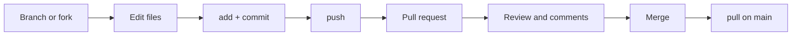

# Workflow

!!! note "Under construction"
    Planned contents are listed below.

The common Git + GitHub cycle, from an idea to merged code.

## Branch or fork

Own repository: create a branch. External repository: fork it first.

## Commit best practices

How to write meaningful commits: atomic changes, clear messages and a
convention such as *Conventional Commits*. This is what keeps a history
readable.

## Commit signing

What a signed commit is, why it matters, and how to configure GPG or SSH
signing so commits show up as *Verified*.

## Pull request

Opening it, describing it, and linking it to an issue.

## Review and merge

Requesting a review, answering comments, and merging. Then `git pull` on the
default branch to bring everything back locally.
