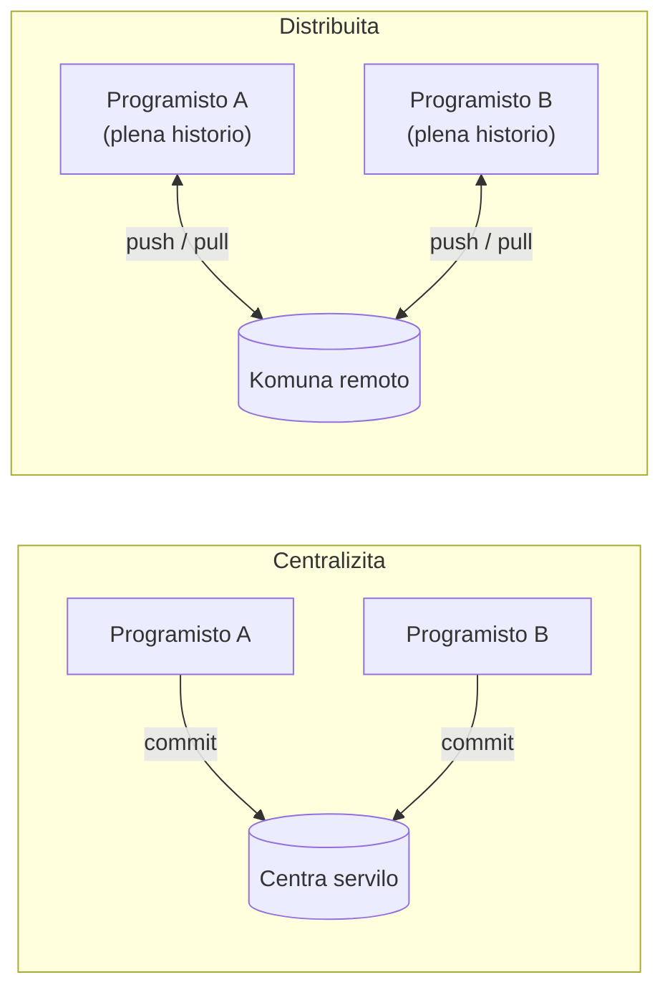
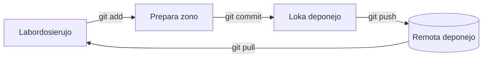

# Kio estas Git

**Git** estas *versikontrola sistemo*: ilo, kiu registras la historion de aro da
dosieroj, tiel ke ĉiun ŝanĝon eblas inspekti, kunhavigi kaj, se necese, malfari.
Ĝi estas la norma maniero verki programaron hodiaŭ, kaj ĝi estas la fundamento sur
kiu konstruiĝas GitHub, kunfandaj petoj (pull requests) kaj kontinua integrado.

Ĉi tiu paĝo klarigas de kie venas Git, kian problemon ĝi solvas, kaj la mensan
modelon, kiun vi bezonas antaŭ ol lerni ajnan komandon.

## Iom da historio

Antaŭ la versikontrolo, konservi la historion de projekto signifis kopii dosierujojn
permane: `projekto/`, `projekto-fina/`, `projekto-fina-VERA/`. Tio ne skaleblas,
estas erarema, kaj malfaciligas la kunlaboron.

Git estis kreita en **2005** de **Linus Torvalds**, la sama persono, kiu komencis
la Linuksan kernon. La kernon disvolvas miloj da kontribuantoj, kaj la ilo, kiun ili
uzis, ĉesis esti senpaga. Torvalds bezonis ion **rapidan**, **distribuitan** kaj
kapablan trakti grandegan historion sen malrapidiĝi. Neniu ekzistanta ilo taŭgis,
do li verkis sian propran en kelkaj semajnoj.

La ŝlosila vorto estas **distribuita**. En la pli malnova generacio de iloj (kiel
Subversion aŭ CVS) estis unu sola centra servilo, kiu tenis *la* historion; oni
devis esti konektita al ĝi por fari commit-on. En Git, **ĉiu klono de deponejo
estas plena kopio de la tuta historio**. Vi povas fari commit-ojn, krei branĉojn,
inspekti la protokolon kaj reiri en la tempo sen reta konekto. Kunhavigi kun aliaj
estas aparta, eksplicita paŝo.

Hodiaŭ Git estas, per granda diferenco, la plej uzata versikontrola sistemo en la
mondo, kaj koni ĝin estas baza profesia kapablo.

## Kial versikontrolo

Eĉ laborante sole, la versikontrolo donas al vi tri aferojn, sen kiuj estas malfacile
vivi, kiam vi ilin havas:

- **Historion.** Ĉiu konservita ŝanĝo estas registrita kun aŭtoro, dato kaj
  mesaĝo. Vi povas legi *kiel* kaj *kial* la projekto atingis sian nunan staton.
- **Sekurecan reton.** Ĉar ĉiu stato estas konservita, vi ĉiam povas reiri al
  versio, kiu funkciis. Eksperimentoj fariĝas malmultekostaj: provu ion, kaj se ĝi
  missukcesas, forĵetu ĝin.
- **Kunlaboron sen surskribado.** Pluraj personoj povas labori pri la samaj
  dosieroj samtempe. Git kunfandas iliajn ŝanĝojn kaj, kiam du personoj redaktas la
  samajn liniojn, indikas ekzakte kie necesas homa decido.

Por teama projekto kiel ĉi tiu, tiu lasta punkto estas la grava: la versikontrolo
estas tio, kio ebligas al ĉiuj kontribui sen paŝi sur la laboron de aliaj.

## La tri zonoj

La plej utila afero por kompreni antaŭ ol tuŝi ajnan komandon estas, ke dosiero en
Git-projekto vivas en unu el **tri zonoj**:

| Zono | Kio ĝi estas |
| --- | --- |
| **Labordosierujo** | La realaj dosieroj sur via disko, tiuj kiujn vi redaktas. |
| **Prepara zono** (aŭ *index*) | Malneta spaco, kie vi kunmetas la *sekvan* commit-on. |
| **Deponejo** | La konstanta, registrita historio de commit-oj. |

La ŝanĝoj fluas de unu zono al la sekva per komandoj, kaj kvara zono — la
**remoto** — estas kopio de la deponejo kunhavigita kun aliaj personoj (tie envenas
GitHub).

Legante la diagramon de maldekstre dekstren:

1. Vi **redaktas** dosierojn en la labordosierujo.
2. `git add` movas instantfoton de la ŝanĝoj, kiujn vi volas konservi, al la
   **prepara zono**. Tio ebligas al vi fari commit-on de *parto* de via laboro kaj
   lasi la reston por poste.
3. `git commit` registras ĉion preparitan kiel konstantan punkton en la **loka
   deponejo**, kun mesaĝo priskribanta ĝin.
4. `git push` sendas viajn commit-ojn al la **remoto**, por ke aliaj vidu ilin;
   `git pull` alportas iliajn commit-ojn al vi.

!!! tip "Kial prepara zono?"
    La prepara zono komence ŝajnas kroma paŝo, sed ĝi estas tio, kio ebligas al vi
    fasoni purajn commit-ojn: vi povas revizii ekzakte kio estos registrita kaj
    disigi nerilatajn ŝanĝojn en apartajn, signifoplenajn commit-ojn anstataŭ unu
    granda amaso.

## Kien iri poste

- [Organizado](organization.md) — kiel commit-oj, branĉoj kaj historio estas fakte
  strukturitaj.
- [Komandoj](commands.md) — la ĉiutaga aro da komandoj, unu post la alia.
- [Ekzemplo](example.md) — la tuta fluo aplikita al ĉi tiu sama deponejo.
