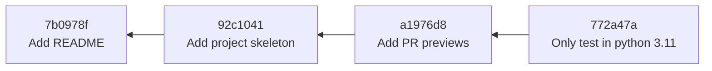
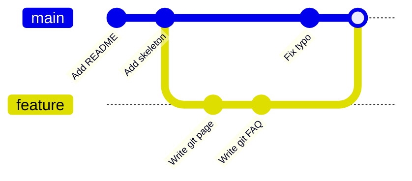
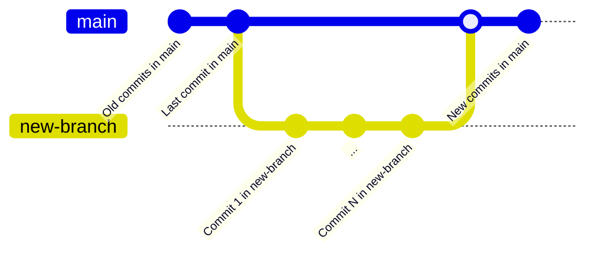
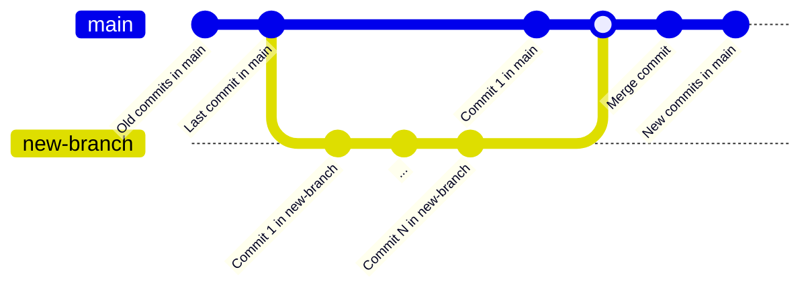

# Organizado

Por uzi Git-on kun memfido, helpas scii kion ĝi konservas interne. Ĉi tiu paĝo
klarigas la tri ideojn, sur kiuj konstruiĝas ĉio alia: **commit-oj**, **diff-oj**
kaj **branĉoj** — kaj kiel ili kuniĝas en la **historio** de projekto.

## Commit-oj kiel instantfotoj

**Commit** estas konservita punkto en la historio de la projekto. La plej ofta
miskompreno estas, ke commit konservas *la ŝanĝojn*, kiujn vi faris. Ne estas tiel:
commit konservas **kompletan instantfoton de ĉiu spurata dosiero** en la momento,
kiam vi faris la commit-on.

Ĉiu commit registras:

- instantfoton de ĉiuj spurataj dosieroj,
- la **aŭtoron** kaj la **daton**,
- **mesaĝon** priskribantan la ŝanĝon,
- referencon al sia **gepatra** commit (tiu, kiu venis antaŭe),
- unikan identigilon: 40-signan **haketaĵon** (*hash*) kiel `772a47a…`,
  kalkulitan el la enhavo mem.

Ĉar ĉiu commit montras al sia gepatro, la historio formas ĉenon. Sekvante la
gepatrajn ligilojn malantaŭen oni atingas ĝis la unua commit.



!!! note "Instantfotoj, sed sen malŝparo"
    Konservi plenan instantfoton por ĉiu commit sonas kvazaŭ ĝi malŝparus grandegan
    spacon. Ne estas tiel: se dosiero ne ŝanĝiĝis inter du commit-oj, Git konservas
    ĝin nur unufoje kaj ambaŭ instantfotoj montras al la sama enhavo. Vi ricevas la
    simplecon de instantfotoj kun la efikeco de nedublado de neŝanĝitaj dosieroj.

La haketaĵo meritas duan rigardon. Ĝi deriviĝas el la enhavo de la commit, do ĝi
estas praktike unika kaj la historio ne estas ŝanĝebla *nerimarkite*: se ŝanĝiĝus eĉ
unu bajto, ŝanĝiĝus ankaŭ ĉiu haketaĵo de tiu punkto antaŭen. Praktike vi malofte tajpas plenan
haketaĵon — la unuaj 7 signoj (`772a47a`) sufiĉas por identigi commit-on.

## Diff-oj

Dum commit konservas instantfoton, tio kion vi kutime *volas vidi* estas la
**diferenco** inter du instantfotoj. Tiu diferenco nomiĝas **diff**, kaj Git
kalkulas ĝin laŭbezone.

Diff legiĝas jene:

```diff
--- a/README.md
+++ b/README.md
@@ -1,3 +1,4 @@
 # NLP Esperantilo

-A small project.
+A rule-based NLP library for Esperanto.
+See the documentation for details.
```

- La linioj `---` / `+++` nomas la malnovan kaj la novan version de la dosiero.
- La linio `@@ … @@` lokalizas la ŝanĝon (la koncernajn liniajn numerojn).
- La linioj komenciĝantaj per `-` estis **forigitaj**; tiuj komenciĝantaj per `+`
  estis **aldonitaj**. Ŝanĝita linio aperas kiel unu forigo kaj unu aldono.
- La nemarkitaj linioj estas neŝanĝita kunteksto, montrata por helpi vin lokalizi
  la ŝanĝon.

Diff-oj estas ĉie en Git: tiel `git diff` montras vian nekonfirmitan laboron, tiel
`git log -p` montras kion ŝanĝis ĉiu commit, kaj tiel kunfanda peto en GitHub
montras kion ĝi proponas.

## Branĉoj

**Branĉo** estas simple **movebla montrilo al commit**. Krei branĉon *ne* kopias
iujn dosierojn; ĝi nur notas "ĉi tiu nomo montras al ĉi tiu commit". Tial branĉoj en
Git estas malmultekostaj kaj rapidaj, kaj tial krei unu por ĉiu tasko estas la norma
praktiko.

Ekzistas speciala montrilo nomata **`HEAD`**, kiu indikas *sur kiu branĉo vi estas
nun*. Kiam vi faras commit-on, la montrilo de la nuna branĉo antaŭeniras al la nova
commit, kaj `HEAD` sekvas ĝin.

La defaŭlta branĉo estas laŭkonvencie nomata **`main`**. Kiam vi komencas novan
taskon, vi kreas branĉon el `main`, faras commit-ojn sur ĝi, kaj poste reintegrigas
ĝin. Dum du branĉoj ekzistas paralele, la historio **diverĝas**:



Reintegrigi branĉon en `main` estas **kunfando** (*merge*). Estas du formoj:

- **Fast-forward.** Se `main` ne moviĝis ekde la kreo de la branĉo, Git povas simple
  ŝovi la montrilon de `main` antaŭen ĝis la plej lasta commit de la branĉo. Neniu
  nova commit kreiĝas; la historio restas lineara.



- **Kunfanda commit.** Se *ambaŭ* branĉoj gajnis commit-ojn (kiel en la supra
  diagramo), Git kreas novan **kunfandan commit-on** kun **du gepatroj**, ligante la
  du liniojn de historio denove kune.



Kiam la du branĉoj ŝanĝis **la samajn liniojn** de la sama dosiero, Git ne povas
decidi kiu versio venkas. Tio estas **kunfanda konflikto**: Git paŭzas kaj petas vin
redakti la dosieron kaj elekti. Konfliktoj estas normala parto de la kunlaboro, ne
eraro — la paĝo [Ekzemplo](example.md) trairas la solvon de unu.

## Historio

Ĉenigi commit-ojn produktas la **historion** de la projekto — la rakonton pri kiel
ĝi atingis sian nunan staton. Bona historio estas valoraĵo: ĝi ebligas al kunlaboranto
(aŭ al vi, post ses monatoj) kompreni *kial* la kodo aspektas tiel, kiel ĝi aspektas.

Kio faras historion facile legebla:

- **Atomaj commit-oj.** Ĉiu commit faras unu koheran aferon, do ĝi kompreneblas,
  revizieblas aŭ malfareblas memstare.
- **Signifoplenaj mesaĝoj.** Mesaĝo kiel `Add stop-word list` diras kio ŝanĝiĝis kaj
  kial; `stuff` aŭ `fix2` ne.
- **Ordigita formo.** Mallongdaŭraj branĉoj, kiuj kunfandiĝas pure, estas pli facile
  sekveblaj ol implikaĵo de longdaŭraj branĉoj.

!!! tip
    Mesaĝoj de commit-oj kaj la higieno de la historio estas traktataj kiel temo de
    laborfluo en la [GitHub-sekcio](../github/workflow.md), ĉar praktike tie pura
    historio profitigas: en kunfandaj petoj kaj koda revizio.

## Kien iri poste

- [Komandoj](commands.md) — la komandoj, kiuj kreas commit-ojn, branĉojn kaj
  diff-ojn.
- [Malfari ŝanĝojn](undoing-changes.md) — kiel movi montrilojn kaj forĵeti laboron
  sekure.
