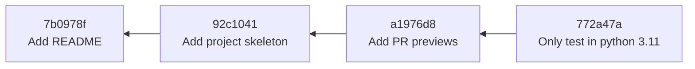
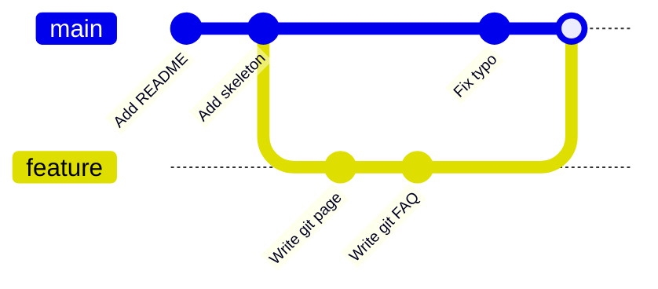
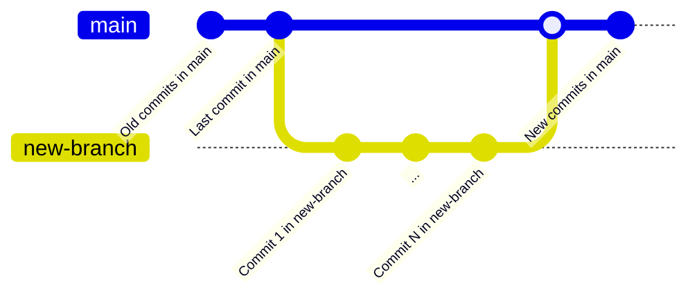
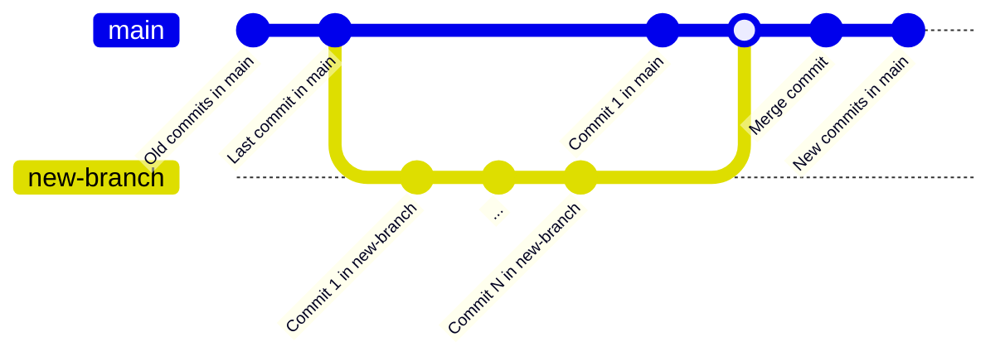

# Organización

Para usar Git con confianza, ayuda saber qué guarda por dentro. Esta página
explica las tres ideas sobre las que se construye todo lo demás: **commits**,
**diffs** y **ramas**, y cómo se combinan para formar el **historial** de un
proyecto.

## Los commits como instantáneas

Un **commit** es un punto guardado en el historial del proyecto. El error más
común es pensar que un commit guarda *los cambios* que hiciste. No es así: un
commit guarda una **instantánea completa de cada archivo rastreado** en el
momento en que hiciste el commit.

Cada commit registra:

- una instantánea de todos los archivos rastreados,
- el **autor** y la **fecha**,
- un **mensaje** que describe el cambio,
- una referencia a su commit **padre** (el que vino antes),
- un identificador único: un **hash** de 40 caracteres como `772a47a…`,
  calculado a partir del propio contenido.

Como cada commit apunta a su padre, el historial forma una cadena. Siguiendo los
enlaces al padre hacia atrás llegas hasta el primerísimo commit.



!!! note "Instantáneas, pero sin desperdicio"
    Guardar una instantánea completa por commit suena a que gastaría una cantidad
    enorme de espacio. No es así: si un archivo no cambió entre dos commits, Git
    lo guarda una sola vez y ambas instantáneas apuntan al mismo contenido.
    Obtienes la simplicidad de las instantáneas con la eficiencia de no duplicar
    los archivos que no cambian.

El hash merece una segunda mirada. Se deriva del contenido del commit, así que es
prácticamente único y el historial no puede alterarse *sin que se note*: si
cambiara un solo byte, cambiarían también todos los hashes a partir de ese punto.
En la
práctica rara vez escribes un hash completo: los primeros 7 caracteres
(`772a47a`) bastan para identificar un commit.

## Diffs

Mientras que un commit guarda una instantánea, lo que normalmente *quieres ver*
es la **diferencia** entre dos instantáneas. Esa diferencia se llama **diff**, y
Git la calcula a demanda.

Un diff se lee así:

```diff
--- a/README.md
+++ b/README.md
@@ -1,3 +1,4 @@
 # NLP Esperantilo

-A small project.
+A rule-based NLP library for Esperanto.
+See the documentation for details.
```

- Las líneas `---` / `+++` nombran la versión antigua y la nueva del archivo.
- La línea `@@ … @@` localiza el cambio (los números de línea implicados).
- Las líneas que empiezan por `-` se **eliminaron**; las que empiezan por `+` se
  **añadieron**. Una línea modificada aparece como una eliminación y una adición.
- Las líneas sin marca son contexto sin cambios, que se muestra para ayudarte a
  ubicar el cambio.

Los diffs están por todas partes en Git: son la forma en que `git diff` muestra
tu trabajo sin confirmar, `git log -p` muestra lo que cambió cada commit, y un
pull request en GitHub muestra lo que propone.

## Ramas

Una **rama** es simplemente un **puntero móvil a un commit**. Crear una rama *no*
copia ningún archivo; solo anota "este nombre apunta a este commit". Por eso las
ramas en Git son baratas y rápidas, y por eso crear una para cada tarea es la
práctica normal.

Existe un puntero especial llamado **`HEAD`** que indica *en qué rama estás
ahora mismo*. Cuando haces un commit, el puntero de la rama actual avanza hasta
el nuevo commit, y `HEAD` lo sigue.

La rama por defecto se llama por convención **`main`**. Cuando empiezas una
tarea nueva, creas una rama a partir de `main`, haces commits en ella y más tarde
la reincorporas. Mientras dos ramas existen en paralelo, el historial **diverge**:



Reincorporar una rama a `main` es una **fusión** (*merge*). Hay dos formas:

- **Fast-forward.** Si `main` no se ha movido desde que se creó la rama, Git
  puede simplemente deslizar el puntero de `main` hasta el último commit de la
  rama. No se crea ningún commit nuevo; el historial se mantiene lineal.



- **Commit de fusión.** Si *ambas* ramas ganaron commits (como en el diagrama de
  arriba), Git crea un nuevo **commit de fusión** con **dos padres**, que vuelve
  a unir las dos líneas de historial.



Cuando las dos ramas cambiaron **las mismas líneas** del mismo archivo, Git no
puede decidir qué versión gana. Esto es un **conflicto de fusión**: Git se
detiene y te pide que edites el archivo y elijas. Los conflictos son una parte
normal de la colaboración, no un error; la página de [Ejemplo](example.md)
muestra cómo resolver uno.

## Historial

Encadenar commits produce el **historial** del proyecto: la historia de cómo
llegó a su estado actual. Un buen historial es un activo: permite que un
compañero (o tú, dentro de seis meses) entienda *por qué* el código es como es.

Lo que hace que un historial sea fácil de leer:

- **Commits atómicos.** Cada commit hace una cosa coherente, de modo que puede
  entenderse, revisarse o revertirse por sí solo.
- **Mensajes con sentido.** Un mensaje como `Add stop-word list` dice qué cambió
  y por qué; `stuff` o `fix2` no.
- **Una forma ordenada.** Las ramas de vida corta que se fusionan limpiamente
  son más fáciles de seguir que una maraña de ramas de larga duración.

!!! tip
    Los mensajes de commit y la higiene del historial se tratan como tema de
    flujo de trabajo en la [sección de GitHub](../github/workflow.md), porque en
    la práctica es ahí donde un historial limpio da sus frutos: en los pull
    requests y la revisión de código.

## Adónde ir después

- [Comandos](commands.md) — los comandos que crean commits, ramas y diffs.
- [Deshacer cambios](undoing-changes.md) — cómo mover punteros y descartar
  trabajo de forma segura.
