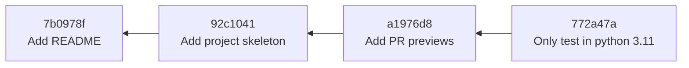
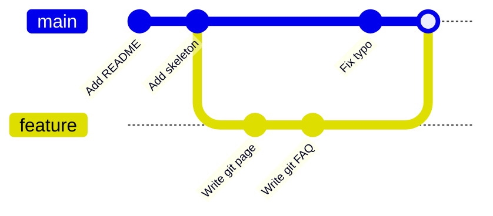

# Organization

To use Git with confidence, it helps to know what it stores under the hood. This
page explains the three ideas everything else is built on: **commits**,
**diffs** and **branches** — and how they add up to a project **history**.

## Commits as snapshots

A **commit** is a saved point in the project's history. The most common
misconception is that a commit stores *the changes* you made. It does not: a
commit stores a **complete snapshot of every tracked file** at the moment you
committed.

Each commit records:

- a snapshot of all tracked files,
- the **author** and the **date**,
- a **message** describing the change,
- a reference to its **parent** commit (the one that came before it),
- a unique identifier: a 40-character **hash** such as
  `772a47a…`, computed from the content itself.

Because every commit points to its parent, the history forms a chain. Following
the parent links backwards takes you all the way to the very first commit.



!!! note "Snapshots, but not wasteful"
    Storing a full snapshot per commit sounds like it would waste enormous
    space. It does not: if a file did not change between two commits, Git stores
    it only once and both snapshots point to the same content. You get the
    simplicity of snapshots with the efficiency of not duplicating unchanged
    files.

The hash is worth a second look. It is derived from the commit's content, so it is
effectively unique and history cannot be altered *unnoticed*: if a single byte
changed, every hash from that point on would change too. In practice you rarely
type a full hash — the first 7 characters (`772a47a`) are enough to identify a
commit.

## Diffs

While a commit stores a snapshot, what you usually *want to see* is the
**difference** between two snapshots. That difference is called a **diff**, and
Git computes it on demand.

A diff is read like this:

```diff
--- a/README.md
+++ b/README.md
@@ -1,3 +1,4 @@
 # NLP Esperantilo

-A small project.
+A rule-based NLP library for Esperanto.
+See the documentation for details.
```

- The `---` / `+++` lines name the old and new versions of the file.
- The `@@ … @@` line locates the change (the line numbers involved).
- Lines starting with `-` were **removed**, lines starting with `+` were
  **added**. A changed line shows up as one removal and one addition.
- Unmarked lines are unchanged context, shown to help you locate the change.

Diffs are everywhere in Git: they are how `git diff` shows your uncommitted
work, how `git log -p` shows what each commit changed, and how a pull request on
GitHub shows what it proposes.

## Branches

A **branch** is simply a **movable pointer to a commit**. Creating a branch does
*not* copy any files; it just writes down "this name points at this commit".
This is why branches in Git are cheap and fast, and why creating one for every
piece of work is normal practice.

There is a special pointer called **`HEAD`** that indicates *which branch you are
currently on*. When you commit, the current branch pointer moves forward to the
new commit, and `HEAD` follows it.

The default branch is conventionally called **`main`**. When you start a new
piece of work, you create a branch off `main`, commit on it, and later bring it
back. While two branches exist in parallel, the history **diverges**:



Bringing a branch back into `main` is a **merge**. There are two shapes:

- **Fast-forward.** If `main` has not moved since the branch was created, Git
  can simply slide the `main` pointer forward to the branch's latest commit. No
  new commit is created; the history stays linear.
- **Merge commit.** If *both* branches gained commits (as in the diagram above),
  Git creates a new **merge commit** with **two parents**, tying the two lines
  of history back together.

When the two branches changed **the same lines** of the same file, Git cannot
decide which version wins. This is a **merge conflict**: Git pauses and asks you
to edit the file and choose. Conflicts are a normal part of collaboration, not
an error — the [Example](example.md) page walks through resolving one.

## History

Chaining commits produces the project's **history** — the story of how it
reached its current state. A good history is an asset: it lets a teammate (or
you, in six months) understand *why* the code looks the way it does.

What makes a history easy to read:

- **Atomic commits.** Each commit does one coherent thing, so it can be
  understood, reviewed or reverted on its own.
- **Meaningful messages.** A message like `Add stop-word list` says what
  changed and why; `stuff` or `fix2` does not.
- **A tidy shape.** Short-lived branches that merge back cleanly are easier to
  follow than a tangle of long-running branches.

!!! tip
    Commit messages and history hygiene are covered as a workflow topic in the
    [GitHub section](../github/workflow.md), because in practice that is where a
    clean history pays off: in pull requests and code review.

## Where to go next

- [Commands](commands.md) — the commands that create commits, branches and
  diffs.
- [Undoing changes](undoing-changes.md) — how to move pointers and discard work
  safely.
