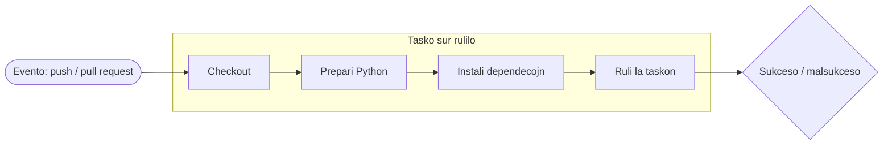

# GitHub Actions

**GitHub Actions** estas la enkonstruita aŭtomatigo de GitHub: ĝi rulas komandojn
sur la serviloj de GitHub kiam ajn io okazas en via deponejo — iu puŝas, malfermas
kunfandan peton, aŭ ekigas rulon permane. Tiel projekto kontrolas sin mem aŭtomate,
anstataŭ dependi de tio, ke ĉiuj memoru.

Ĉi tiu paĝo klarigas la vortprovizon, kaj poste trairas la **kvar realajn
laborfluojn** de ĉi tiu deponejo kiel praktikajn ekzemplojn.

## Kio estas laborfluo (workflow)

**Laborfluo** estas YAML-dosiero en `.github/workflows/`. GitHub legas ĉiun dosieron
en tiu dosierujo kaj rulas ĝin kiam ekiĝas ĝia ekiga evento. La partoj, kiujn vi
bezonas koni:

- **Evento** — *kio* ekigas la laborfluon: `push`, `pull_request`, mana
  `workflow_dispatch`, ktp. Deklarita sub `on:`.
- **Tasko (job)** — laborunuo, kiu ruliĝas sur nova virtuala maŝino. Laborfluo povas
  havi plurajn, ruliĝantajn paralele defaŭlte.
- **Rulilo (runner)** — la maŝino sur kiu ruliĝas tasko, ekz. `runs-on:
  ubuntu-latest`.
- **Paŝo (step)** — unuopa komando aŭ reuzebla **action** (`uses:`) ene de tasko. La
  paŝoj ruliĝas laŭvice kaj kunhavigas la saman maŝinon.



La rulojn vi rigardas en la langeto **Actions** de la deponejo. Ĉiu rulo montras
siajn taskojn kaj paŝojn kun verda marko aŭ ruĝa kruco, kaj la plenan protokolon de
ĉiu komando — la unua loko kie rigardi kiam kontrolo malsukcesas.

!!! info "Legi statuskontrolon sur kunfanda peto"
    Sur kunfanda peto, ĉiu laborfluo raportas reen kiel **statuskontrolo** (*status
    check*). Verda signifas, ke ĉiuj paŝoj sukcesis; ruĝa signifas, ke io
    malsukcesis kaj estas protokolo por legi. La
    [Agordo de la deponejo](repository-configuration.md) montras kiel igi ĉi tiujn
    kontrolojn *devigaj* antaŭ ol kunfando estas permesata.

## La laborfluoj de ĉi tiu deponejo

Ĉi tiu deponejo rulas kvar laborfluojn, ĉiuj videblaj en
[`.github/workflows/`](https://github.com/jparisu/nlp-esperantilo/tree/main/.github/workflows):

| Laborfluo | Dosiero | Kion ĝi faras |
| --- | --- | --- |
| Tests | `tests.yml` | Rulas `pytest` per matrico de Python-versioj. |
| Documentation | `docs.yml` | Konstruas la MkDocs-paĝaron kaj publikigas ĝin al GitHub Pages el `main`. |
| Documentation preview | `docs-preview.yml` | Konstruas la paĝaron por kunfanda peto kaj publikigas ĝin al antaŭrigarda URL. |
| Spell check | `spellcheck.yml` | Rulas `codespell` sur la dokumentaro kaj la kodo. |

La sekvaj sekcioj rigardas ĉiun.

## Ruli la Python-testojn

[`tests.yml`](https://github.com/jparisu/nlp-esperantilo/blob/main/.github/workflows/tests.yml)
rulas la testaron ĉe ĉiu push kaj kunfanda peto al `main`. Ĝia tasko sekvas la
kanonan formon — checkout, prepari Python, instali, testi:

```yaml
on:
  push:
    branches: [main]
  pull_request:
    branches: [main]
  workflow_dispatch:          # ankaŭ rulebla permane el la langeto Actions

jobs:
  pytest:
    runs-on: ubuntu-latest
    strategy:
      matrix:
        python-version: ["3.13"]
    steps:
      - uses: actions/checkout@v4
      - uses: actions/setup-python@v5
        with:
          python-version: ${{ matrix.python-version }}
      - run: pip install -e ".[test]"
      - run: pytest
```

Indas elstarigi du ideojn:

- **La matrico.** `strategy.matrix` rulas la taskon unufoje por ĉiu valoro kiun ĝi
  listigas. Ĉi tie ĝi listigas unu solan version, `3.13`, sed aldoni pliajn —
  `["3.11", "3.12", "3.13"]` — rulus la testaron sur ĉiu paralele, kaptante
  versio-specifajn rompojn. La matrico estas la mekanismo; la listo estas elekto de
  la projekto.
- **Instali la pakon mem.** `pip install -e ".[test]"` instalas la bibliotekon *kaj*
  ĝian testan kromaĵon (vidu
  [Python-Biblioteko § Organizado](../python-library/organization.md)), por ke la
  testoj importu ĝin ekzakte kiel farus uzanto.

## Generi kaj disfaldi la dokumentaron

[`docs.yml`](https://github.com/jparisu/nlp-esperantilo/blob/main/.github/workflows/docs.yml)
konstruas ĉi tiun paĝaron kaj publikigas ĝin. Ĝi ruliĝas **ĉe push al `main`** (kaj
laŭpete), ĉar la publika paĝaro devus reflekti kunfanditan laboron, ne nefinitan:

```yaml
on:
  push:
    branches: [main]
  workflow_dispatch:          # redisfaldi permane el la langeto Actions

permissions:
  contents: write            # necesa por puŝi la konstruitan paĝaron al gh-pages

jobs:
  deploy:
    steps:
      - uses: actions/checkout@v4
      - uses: actions/setup-python@v5
        with:
          python-version: "3.11"
      - run: pip install -r docs/requirements.txt
      - run: mkdocs build --strict --site-dir site
      - uses: JamesIves/github-pages-deploy-action@v4
        with:
          folder: site
          branch: gh-pages
          clean-exclude: pr-preview/
```

- **`mkdocs build --strict`** transformas la avertojn — rompita ligilo, mankanta
  dosiero — en erarojn, do eraro malsukcesigas la konstruon anstataŭ publikiĝi
  silente. (Ĝi estas la sama komando, kiun vi devus ruli loke antaŭ ol puŝi.)
- **`permissions: contents: write`** — laborfluo, kiu *skribas* al la deponejo (ĉi
  tie, puŝante la konstruitan paĝaron al la branĉo `gh-pages`) bezonas skriban
  permeson; la defaŭlto estas nur-lega.
- **`clean-exclude: pr-preview/`** — publikigi la realan paĝaron ne devas forigi la
  antaŭrigardojn de kunfandaj petoj, kiuj vivas en la sama branĉo. Ĉi tio ligas rekte
  al la sekva laborfluo.

La mekanikon de la branĉo `gh-pages` kaj la rezultan URL-on kovras
[GitHub Pages](pages.md).

## Antaŭrigardi la dokumentaron de kunfanda peto

[`docs-preview.yml`](https://github.com/jparisu/nlp-esperantilo/blob/main/.github/workflows/docs-preview.yml)
donas al ĉiu kunfanda peto sian **propran publikigitan kopion** de la paĝaro, por ke
reviziinto povu legi la generitan dokumentaron antaŭ ol ĝi kunfandiĝas — sen tuŝi la
publikan paĝaron.

Ĝi enkondukas tri konceptojn preter la baza laborfluo:

- **La evento `closed`.** Ĝi ekiĝas per `types: [opened, reopened, synchronize,
  closed]`. La unuaj tri (re)konstruas kaj publikigas la antaŭrigardon; `closed`
  rulas purigon, kiu **forigas** la antaŭrigardon kiam la kunfanda peto estas
  kunfandita aŭ fermita, por ke la antaŭrigardoj ne amasiĝu.
- **Superskribi la agordon dum konstruo.** Ĝi difinas mediovariablon `SITE_URL`, por
  ke la kanonaj ligiloj kaj la lingva ŝaltilo de la antaŭrigardo montru al la
  antaŭrigardo, ne al la produkta paĝaro — la kialo, kial
  [mkdocs.yml](https://github.com/jparisu/nlp-esperantilo/blob/main/mkdocs.yml) legas
  `site_url` el la medio.
- **Fork-oj ne ricevas skriban ĵetonon.** La disfalda paŝo ruliĝas nur kiam
  `github.event.pull_request.head.repo.full_name == github.repository` — t.e. kiam la
  kunfanda peto venas de branĉo de *ĉi tiu* deponejo. La kunfanda peto de fork ruliĝas
  kun **nur-lega ĵetono** kaj ne povas publikigi; ĝia dokumentaro tamen konstruiĝas
  kaj kontroliĝas, ĝi nur ne ricevas antaŭrigardan URL-on.

Ĉi tiu konstrua paŝo estas ankaŭ la **pordo de la kunfanda peto**: ĉar ĝi rulas
`mkdocs build --strict`, rompita ligilo malsukcesigas la kontrolon antaŭ ol io
publikiĝas. Vidu
[GitHub Pages § Antaŭrigardi kunfandan peton](pages.md#antaurigardi-kunfandan-peton)
por tio, kion vidas la reviziinto.

## Ortografia kontrolo

[`spellcheck.yml`](https://github.com/jparisu/nlp-esperantilo/blob/main/.github/workflows/spellcheck.yml)
rulas [`codespell`](https://github.com/codespell-project/codespell) sur la
dokumentaro kaj la kodo ĉe ĉiu push kaj kunfanda peto, kaptante kutimajn tajperarojn
aŭtomate:

```yaml
- run: pip install codespell
- run: codespell            # la agordo venas de .codespellrc
```

La interesa parto estas instrui al la kontrolilo la vortojn, kiujn ĝi ne konas —
Esperantajn terminojn, proprajn nomojn, teknikan ĵargonon — por ke ili ne estu
raportataj kiel eraroj. Tiu agordo vivas en
[`.codespellrc`](https://github.com/jparisu/nlp-esperantilo/blob/main/.codespellrc):

```ini
[codespell]
skip = ./.git,./.devs,./site,./.venv,...   # vojoj kiujn ne kontroli
ignore-words = .codespell-ignore-words.txt # akceptita vortprovizo de la projekto
builtin = clear,rare                        # nur memfidaj korektoj
```

Teni la agordon en dosiero (anstataŭ en la laborfluo) signifas, ke **loka rulo de
`codespell` kondutas ekzakte kiel CI** — vi povas kapti kaj korekti tajperaron antaŭ
ol vi eĉ puŝas.

!!! tip "Ruli la kontrolojn unue loke"
    Ĉiu kontrolo ĉi tie estas simple komando, kiun vi mem povas ruli: `pytest`,
    `mkdocs build --strict`, `codespell`. Ruli ilin loke antaŭ ol puŝi transformas
    ruĝan kunfandan peton en verdan ĉe la unua provo.

## Kien iri poste

- [Agordo de la deponejo](repository-configuration.md) — igu ĉi tiujn kontrolojn
  *devigaj* antaŭ kunfando.
- [GitHub Pages](pages.md) — kiel la konstruo de la dokumentaro atingas la reton.
