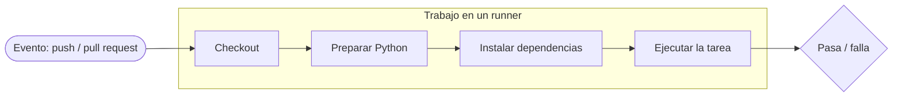

# GitHub Actions

**GitHub Actions** es la automatización integrada de GitHub: ejecuta comandos en
los servidores de GitHub cada vez que ocurre algo en tu repositorio — alguien
hace push, abre un pull request o dispara una ejecución a mano. Es la forma en que
un proyecto se comprueba a sí mismo automáticamente, en lugar de depender de que
todos se acuerden.

Esta página explica el vocabulario y luego recorre los **cuatro workflows reales**
de este repositorio como ejemplos prácticos.

## Qué es un workflow

Un **workflow** es un archivo YAML en `.github/workflows/`. GitHub lee cada
archivo de esa carpeta y lo ejecuta cuando se dispara su desencadenante. Las
piezas que necesitas conocer:

- **Evento (event)** — *qué* dispara el workflow: `push`, `pull_request`, un
  `workflow_dispatch` manual, etc. Se declara bajo `on:`.
- **Trabajo (job)** — una unidad de trabajo que se ejecuta en una máquina virtual
  nueva. Un workflow puede tener varios, ejecutándose en paralelo por defecto.
- **Runner** — la máquina en la que se ejecuta un job, p. ej. `runs-on:
  ubuntu-latest`.
- **Paso (step)** — un solo comando o una **action** reutilizable (`uses:`)
  dentro de un job. Los pasos se ejecutan en orden y comparten la misma máquina.



Las ejecuciones se ven en la pestaña **Actions** del repositorio. Cada ejecución
muestra sus jobs y pasos con una marca verde o una cruz roja, y el log completo de
cada comando — el primer sitio donde mirar cuando una comprobación falla.

!!! info "Leer una comprobación de estado en un pull request"
    En un pull request, cada workflow informa como una **comprobación de estado**
    (*status check*). Verde significa que todos los pasos pasaron; rojo significa
    que algo falló y hay un log que leer. La
    [Configuración del repositorio](repository-configuration.md) muestra cómo hacer
    que estas comprobaciones sean *obligatorias* antes de permitir una fusión.

## Los workflows de este repositorio

Este repositorio ejecuta cuatro workflows, todos visibles en
[`.github/workflows/`](https://github.com/jparisu/nlp-esperantilo/tree/main/.github/workflows):

| Workflow | Archivo | Qué hace |
| --- | --- | --- |
| Tests | `tests.yml` | Ejecuta `pytest` mediante una matriz de versiones de Python. |
| Documentation | `docs.yml` | Construye el sitio MkDocs y lo publica en GitHub Pages desde `main`. |
| Documentation preview | `docs-preview.yml` | Construye el sitio para un pull request y lo publica en una URL de previsualización. |
| Spell check | `spellcheck.yml` | Ejecuta `codespell` sobre la documentación y el código. |

Las secciones siguientes miran cada uno.

## Ejecutar las pruebas de Python

[`tests.yml`](https://github.com/jparisu/nlp-esperantilo/blob/main/.github/workflows/tests.yml)
ejecuta la suite de pruebas en cada push y pull request a `main`. Su job sigue la
forma canónica — checkout, preparar Python, instalar, probar:

```yaml
on:
  push:
    branches: [main]
  pull_request:
    branches: [main]
  workflow_dispatch:          # también ejecutable a mano desde la pestaña Actions

jobs:
  pytest:
    runs-on: ubuntu-latest
    strategy:
      matrix:
        python-version: ["3.13"]
    steps:
      - uses: actions/checkout@v4
      - uses: actions/setup-python@v5
        with:
          python-version: ${{ matrix.python-version }}
      - run: pip install -e ".[test]"
      - run: pytest
```

Vale la pena destacar dos ideas:

- **La matriz.** `strategy.matrix` ejecuta el job una vez por cada valor que
  lista. Aquí lista una sola versión, `3.13`, pero añadir más —
  `["3.11", "3.12", "3.13"]` — ejecutaría la suite en cada una en paralelo,
  detectando fallos específicos de versión. La matriz es el mecanismo; la lista es
  una decisión del proyecto.
- **Instalar el propio paquete.** `pip install -e ".[test]"` instala la biblioteca
  *y* su extra de pruebas (véase
  [Biblioteca Python § Organización](../python-library/organization.md)), de modo
  que las pruebas la importan exactamente como lo haría un usuario.

## Renderizar y desplegar la documentación

[`docs.yml`](https://github.com/jparisu/nlp-esperantilo/blob/main/.github/workflows/docs.yml)
construye este sitio y lo publica. Se ejecuta **en push a `main`** (y a demanda),
porque el sitio público debe reflejar el trabajo fusionado, no el trabajo en curso:

```yaml
on:
  push:
    branches: [main]
  workflow_dispatch:          # volver a desplegar a mano desde la pestaña Actions

permissions:
  contents: write            # necesario para subir el sitio construido a gh-pages

jobs:
  deploy:
    steps:
      - uses: actions/checkout@v4
      - uses: actions/setup-python@v5
        with:
          python-version: "3.11"
      - run: pip install -r docs/requirements.txt
      - run: mkdocs build --strict --site-dir site
      - uses: JamesIves/github-pages-deploy-action@v4
        with:
          folder: site
          branch: gh-pages
          clean-exclude: pr-preview/
```

- **`mkdocs build --strict`** convierte las advertencias —un enlace roto, un
  archivo que falta— en errores, de modo que un fallo hace fracasar la
  construcción en lugar de publicarse en silencio. (Es el mismo comando que
  deberías ejecutar en local antes de hacer push.)
- **`permissions: contents: write`** — un workflow que *escribe* en el repositorio
  (aquí, subir el sitio construido a la rama `gh-pages`) necesita permiso de
  escritura; el valor por defecto es solo lectura.
- **`clean-exclude: pr-preview/`** — publicar el sitio real no debe borrar las
  previsualizaciones de pull request que viven en la misma rama. Esto enlaza
  directamente con el siguiente workflow.

Los mecanismos de la rama `gh-pages` y la URL resultante se cubren en
[GitHub Pages](pages.md).

## Previsualizar la documentación de un pull request

[`docs-preview.yml`](https://github.com/jparisu/nlp-esperantilo/blob/main/.github/workflows/docs-preview.yml)
da a cada pull request su **propia copia publicada** del sitio, para que quien
revisa pueda leer la documentación renderizada antes de fusionarla — sin tocar el
sitio público.

Introduce tres conceptos más allá del workflow básico:

- **El evento `closed`.** Se dispara con
  `types: [opened, reopened, synchronize, closed]`. Los tres primeros
  (re)construyen y publican la previsualización; `closed` ejecuta una limpieza que
  **borra** la previsualización cuando el pull request se fusiona o se cierra, para
  que las previsualizaciones no se acumulen.
- **Sobrescribir la configuración en tiempo de construcción.** Define una variable
  de entorno `SITE_URL` para que los enlaces canónicos y el selector de idioma de
  la previsualización apunten a la previsualización, no al sitio de producción — la
  razón por la que [mkdocs.yml](https://github.com/jparisu/nlp-esperantilo/blob/main/mkdocs.yml)
  lee `site_url` del entorno.
- **Los forks no reciben token de escritura.** El paso de despliegue se ejecuta
  solo cuando `github.event.pull_request.head.repo.full_name == github.repository`
  — es decir, cuando el pull request viene de una rama de *este* repositorio. El
  pull request de un fork se ejecuta con un **token de solo lectura** y no puede
  publicar; su documentación igualmente se construye y se comprueba, solo que no
  obtiene URL de previsualización.

Este paso de construcción es además la **puerta del pull request**: como ejecuta
`mkdocs build --strict`, un enlace roto hace fallar la comprobación antes de que
se publique nada. Véase
[GitHub Pages § Previsualizar un pull request](pages.md#previsualizar-un-pull-request)
para lo que ve quien revisa.

## Corrección ortográfica

[`spellcheck.yml`](https://github.com/jparisu/nlp-esperantilo/blob/main/.github/workflows/spellcheck.yml)
ejecuta [`codespell`](https://github.com/codespell-project/codespell) sobre la
documentación y el código en cada push y pull request, detectando erratas comunes
automáticamente:

```yaml
- run: pip install codespell
- run: codespell            # la configuración viene de pyproject.toml
```

La parte interesante es enseñarle al corrector las palabras que no conoce —
términos en Esperanto, nombres propios, jerga técnica— para que no se reporten como
errores. Esa configuración vive en
[`pyproject.toml`](https://github.com/jparisu/nlp-esperantilo/blob/main/pyproject.toml):

```ini
[tool.codespell]
skip = ./.git,./.devs,./site,./.venv,...   # rutas que no se comprueban
ignore-words = ".codespell/ignore-words.txt" # vocabulario aceptado del proyecto
builtin = clear,rare                        # solo correcciones con confianza
```

Mantener la configuración en un archivo (en lugar de en el workflow) significa que
una **ejecución local de `codespell` se comporta exactamente igual que en CI** —
puedes detectar y corregir una errata antes incluso de hacer push.

!!! tip "Ejecuta primero las comprobaciones en local"
    Cada comprobación aquí es simplemente un comando que puedes ejecutar tú mismo:
    `pytest`, `mkdocs build --strict`, `codespell`. Ejecutarlos en local antes de
    hacer push convierte un pull request rojo en uno verde al primer intento.

## Adónde ir después

- [Configuración del repositorio](repository-configuration.md) — haz que estas
  comprobaciones sean *obligatorias* antes de fusionar.
- [GitHub Pages](pages.md) — cómo la construcción de la documentación llega a la
  web.
