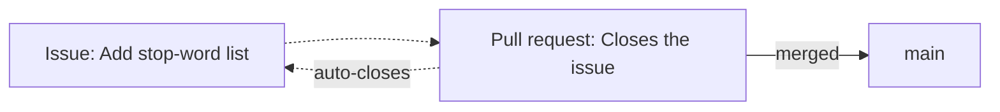

# Unuaj paŝoj

Ĉi tiu paĝo kondukas vin de *neniu konto* al *via propra deponejo en GitHub*, preta
por la [laborfluo](workflow.md) kiu sekvas. Se vi jam havas konton kaj deponejon, vi
povas trarigardi ĝin kaj salti antaŭen.

## Krei konton

Iru al [github.com](https://github.com) kaj registriĝu. Senpaga konto sufiĉas por
ĉio en ĉi tiu gvidilo, inkluzive de privataj deponejoj kaj GitHub Actions.

Du fruajn paŝojn indas fari bone:

- **Vian profilon.** Uzu rekoneblan uzantnomon kaj realan nomon — en teama
  projekto, viaj kunlaborantoj kaj instruistoj bezonas scii kiu estas kiu. Viaj
  commit-oj estas ligitaj al la retpoŝta adreso agordita en
  [`git config`](../git/example.md), do uzu ĉi tie la saman retpoŝton.
- **Aŭtentigon por puŝi.** Ensaluti al la retejo uzas pasvorton; puŝi de la
  komandolinio **ne**. Vi bezonas unu el ĉi tiuj:
    - **Personal Access Token (PAT)**, uzatan anstataŭ pasvorto per HTTPS, aŭ
    - **SSH-ŝlosilon**, ŝlosilparon, kies publikan duonon vi aldonas al GitHub.

!!! tip "Kiun mi uzu?"
    Por labori en kajeroj aŭ puŝi malofte, **PAT per HTTPS** estas la plej simpla:
    kreu ĝin en **Settings → Developer settings → Personal access tokens**, kaj
    algluu ĝin kiam Git petas pasvorton. Por ofta loka laboro, **SSH-ŝlosilo**
    (aldonita en **Settings → SSH and GPG keys**) evitas retajpi ion ajn. Ambaŭ
    taŭgas — elektu unu kaj daŭrigu.

<!-- TODO: Add more information on how to set up the local machine
  Point at the GitHub pages with the instructions, and add step-by-step
  instructions here for each case (in tabs if possible).
 -->

## Krei deponejon

Klaku **New** (la verda butono sur via paĝo de deponejoj) kaj plenigu:

- **Nomo** — mallonga kaj priskriba, ekz. `nlp-esperantilo`.
- **Videbleco** — **publika** (ĉiu povas vidi ĝin) aŭ **privata** (nur vi kaj
  invititaj kunlaborantoj). Vi povas ŝanĝi ĉi tion poste.
- **Ekigi kun** — GitHub povas aldoni por vi tri dosierojn en la momento de la kreo:
    - **README**, la ĉefpaĝon de la deponejo;
    - **`.gitignore`**, antaŭplenigitan por la lingvo kiun vi elektas (elektu
      *Python*);
    - **licencon**, kiu diras kiel aliaj povas uzi vian kodon.

!!! note "README, .gitignore kaj licenco"
    Lasi GitHub-on krei ĉi tiujn signifas, ke la deponejo komenciĝas jam kun unu
    commit ene. Se anstataŭe vi konstruis la deponejon loke (kiel en la
    [Git-ekzemplo](../git/example.md)), lasu ĉi tiujn markobutonojn nemarkitaj kaj
    puŝu vian propran historion.

## Agordi ĝin

Kelkajn agordojn indas ŝanĝi frue, el la langeto **Settings** de la deponejo kaj ĝia
ĉefpaĝo:

- **Priskribo kaj temoj (topics).** Unulinia priskribo kaj kelkaj temaj etikedoj
  igas la deponejon pli facile trovebla kaj komprenebla.
- **Kunlaborantoj.** En **Settings → Collaborators**, invitu viajn teamanojn por ke
  ili povu puŝi al branĉoj kaj revizii kunfandajn petojn.
- **Defaŭlta branĉo.** Konfirmu, ke ĝi nomiĝas `main`.

La agordo, kiu *altrudas* sanan teaman laborfluon — protekti `main`, postuli
reviziojn kaj sukcesajn kontrolojn — estas sufiĉe grava por havi sian propran paĝon:
[Agordo de la deponejo](repository-configuration.md). Agordu tion kiam la laborfluo
kaj la Actions estas surloke.

## Esplori

La plej grandan parton de via tempo en GitHub vi pasigas legante deponejojn *de
aliaj personoj*. Ĉiu deponejo havas la samajn langetojn, kaj koni ilin igas legebla
ajnan projekton:

| Langeto |  |
| --- | --- |
| **Code** | La dosierojn, la README, la branĉan elektilon kaj la historion de commit-oj. |
| **Issues** | Raportitajn cimojn, taskojn kaj funkcio-petojn, malfermitajn kaj fermitajn. |
| **Pull requests** | Proponitajn ŝanĝojn en revizio, kaj la jam kunfanditajn. |
| **Actions** | La aŭtomatajn rulojn (testojn, konstruojn) kaj ĉu ili sukcesis. |
| **Insights** | La kontribuan agadon, kaj bildon pri kiel la projekto moviĝas. |

Trarigardi bone administratan projekton — legi kiel estas priskribitaj ĝiaj kunfandaj
petoj kaj kiel estas diskutataj ĝiaj problemoj — estas unu el la plej bonaj manieroj
lerni la konvenciojn de la programara kunlaboro.

## Problemoj kaj kunfandaj petoj

Ĉi tiuj du estas la spino de la kunlaboro en GitHub, kaj ili ludas malsamajn rolojn:

- **Problemo (issue)** priskribas *ion farendan aŭ riparendan*: cimon, taskon,
  demandon. Ĝi estas konversacio, ne kodo. La problemoj estas numeritaj (`#12`) kaj
  povas esti etikeditaj kaj asignitaj.
- **Kunfanda peto (pull request, PR)** proponas *realan ŝanĝon al la kodo*: "jen
  branĉo kun commit-oj, bonvolu revizii kaj kunfandi ĝin". Ĝi ankaŭ estas numerita
  kaj diskutata, sed ĝi portas diff-on.

La du referencas unu la alian. Kunfanda peto povas diri *"Closes #12"* en sia
priskribo, kaj kiam ĝi kunfandiĝas, GitHub aŭtomate fermas la problemon #12 kaj
kunligas la du. Ĉi tio ligas la *planon* (problemoj) al la *laboro* (kunfandaj
petoj) en spurebla historio.

La kunfanda peto mem — kiel malfermi, priskribi, revizii kaj kunfandi ĝin — estas la
temo de la sekva paĝo.

## Kien iri poste

- [Laborfluo](workflow.md) — la kompleta ciklo branĉo → commit → kunfanda peto →
  kunfando.
