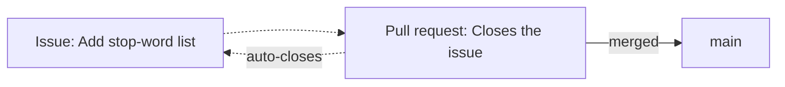

# Primeros pasos

Esta página te lleva de *no tener cuenta* a *tener tu propio repositorio en
GitHub*, listo para el [flujo de trabajo](workflow.md) que sigue. Si ya tienes
cuenta y un repositorio, puedes ojearla y saltar adelante.

## Crear una cuenta

Ve a [github.com](https://github.com) y regístrate. Una cuenta gratuita basta
para todo lo de esta guía, incluidos los repositorios privados y GitHub Actions.

Dos pasos iniciales conviene hacerlos bien:

- **Tu perfil.** Usa un nombre de usuario reconocible y un nombre real — en un
  proyecto en equipo, tus compañeros y profesores necesitan saber quién es quién.
  Tus commits se vinculan a la dirección de correo configurada en
  [`git config`](../git/example.md), así que usa aquí el mismo correo.
- **Autenticación para hacer push.** Iniciar sesión en el sitio web usa una
  contraseña; hacer push desde la línea de comandos **no**. Necesitas una de
  estas dos:
    - un **Personal Access Token (PAT)**, usado en lugar de una contraseña sobre
      HTTPS, o
    - una **clave SSH**, un par de claves cuya mitad pública añades a GitHub.

!!! tip "¿Cuál debo usar?"
    Para trabajar en notebooks o hacer push de vez en cuando, un **PAT sobre
    HTTPS** es lo más simple: créalo en **Settings → Developer settings →
    Personal access tokens**, y pégalo cuando Git te pida una contraseña. Para
    trabajo local frecuente, una **clave SSH** (añadida en **Settings → SSH and
    GPG keys**) evita tener que reescribir nada. Cualquiera vale — elige una y
    sigue adelante.

### Configurar la autenticación en tu máquina

Elige una de las dos pestañas para autenticarte. No necesitas las dos.

=== "PAT sobre HTTPS"

    **1. Crea el token.** En GitHub, **Settings → Developer settings → Personal
    access tokens → Fine-grained tokens → Generate new token**. Ponle un nombre,
    una caducidad y, en **Repository access**, elige los repositorios a los que
    da acceso. En **Permissions → Repository permissions** necesitas al menos
    **Contents: Read and write**.

    **2. Cópialo ahora.** El token se muestra una sola vez. Si lo pierdes, hay
    que generar otro.

    **3. Clona por HTTPS.** Git te pedirá usuario y contraseña: pega el token
    como contraseña, no la de tu cuenta.

    ```bash
    git clone https://github.com/<usuario>/<repositorio>.git
    ```

    **4. Evita repetirlo en cada push.** Guarda las credenciales con un
    *credential helper*:

    ```bash
    # Windows: viene con Git for Windows, cifrado
    git config --global credential.helper manager

    # macOS: las guarda en el llavero del sistema
    git config --global credential.helper osxkeychain

    # Linux: en texto plano, en ~/.git-credentials
    git config --global credential.helper store
    ```

    !!! warning "`store` guarda el token sin cifrar"
        En Linux, `store` deja el token legible en `~/.git-credentials`. Vale
        para una máquina personal; en un ordenador compartido usa
        `credential.helper cache`, que solo lo mantiene en memoria un rato.

    Documentación oficial:
    [Managing your personal access tokens](https://docs.github.com/es/authentication/keeping-your-account-and-data-secure/managing-your-personal-access-tokens).

=== "Clave SSH"

    **1. Genera el par de claves.** Acepta la ruta que propone. La *passphrase*
    es opcional, pero conviene ponerla: protege la clave si alguien accede a tu
    disco.

    ```bash
    ssh-keygen -t ed25519 -C "tu-correo@ejemplo.com"
    ```

    **2. Registra la clave en el agente**, para no escribir la passphrase en
    cada operación:

    ```bash
    eval "$(ssh-agent -s)"
    ssh-add ~/.ssh/id_ed25519
    ```

    **3. Copia la clave pública.** Es la que termina en `.pub`; la otra no sale
    nunca de tu máquina.

    ```bash
    cat ~/.ssh/id_ed25519.pub
    ```

    **4. Añádela a GitHub.** En **Settings → SSH and GPG keys → New SSH key**,
    pega el contenido, ponle un nombre que identifique el ordenador y guarda.

    **5. Comprueba y clona por SSH.** La primera conexión te pedirá confirmar la
    huella del servidor.

    ```bash
    ssh -T git@github.com
    git clone git@github.com:<usuario>/<repositorio>.git
    ```

    Documentación oficial:
    [Generating a new SSH key](https://docs.github.com/es/authentication/connecting-to-github-with-ssh/generating-a-new-ssh-key-and-adding-it-to-the-ssh-agent)
    y
    [Adding a new SSH key to your GitHub account](https://docs.github.com/es/authentication/connecting-to-github-with-ssh/adding-a-new-ssh-key-to-your-github-account).

!!! tip "¿Ya habías clonado con el método equivocado?"
    No hace falta volver a clonar. El método de autenticación lo decide la URL
    del remoto, y se puede cambiar:

    ```bash
    git remote -v                                              # ver la actual
    git remote set-url origin git@github.com:<usuario>/<repositorio>.git
    ```

Con cualquiera de las dos, identifícate en Git antes del primer commit — el
mismo correo que usaste en GitHub, para que los commits te aparezcan atribuidos:

```bash
git config --global user.name "Tu Nombre"
git config --global user.email "tu-correo@ejemplo.com"
```

## Crear un repositorio

Haz clic en **New** (el botón verde en tu página de repositorios) y rellena:

- **Nombre** — corto y descriptivo, p. ej. `nlp-esperantilo`.
- **Visibilidad** — **público** (cualquiera puede verlo) o **privado** (solo tú y
  los colaboradores invitados). Puedes cambiarlo más tarde.
- **Inicializar con** — GitHub puede añadirte tres archivos en el momento de la
  creación:
    - un **README**, la portada del repositorio;
    - un **`.gitignore`**, precargado para el lenguaje que elijas (elige
      *Python*);
    - una **licencia**, que indica cómo pueden usar los demás tu código.

!!! note "README, .gitignore y licencia"
    Dejar que GitHub los cree significa que el repositorio empieza ya con un
    commit dentro. Si en cambio construiste el repositorio en local (como en el
    [ejemplo de Git](../git/example.md)), deja estas casillas sin marcar y sube tu
    propio historial.

## Configurarlo

Conviene cambiar pronto algunos ajustes, desde la pestaña **Settings** del
repositorio y su página principal:

- **Descripción y temas (topics).** Una descripción de una línea y unas cuantas
  etiquetas de tema hacen el repositorio más fácil de encontrar y entender.
- **Colaboradores.** En **Settings → Collaborators**, invita a tus compañeros para
  que puedan hacer push a las ramas y revisar los pull requests.
- **Rama por defecto.** Confirma que se llama `main`.

La configuración que *impone* un flujo de trabajo de equipo saludable —proteger
`main`, exigir revisiones y comprobaciones que pasen— es lo bastante importante
como para tener su propia página: [Configuración del repositorio](repository-configuration.md).
Configúrala una vez que el flujo de trabajo y las Actions estén en su sitio.

## Explorar

La mayor parte de tu tiempo en GitHub la pasas leyendo repositorios *de otras
personas*. Todos los repositorios tienen las mismas pestañas, y conocerlas hace
legible cualquier proyecto:

| Pestaña |  |
| --- | --- |
| **Code** | Los archivos, el README, el selector de ramas y el historial de commits. |
| **Issues** | Errores reportados, tareas y peticiones de funciones, abiertos y cerrados. |
| **Pull requests** | Cambios propuestos en revisión, y los ya fusionados. |
| **Actions** | Las ejecuciones automatizadas (pruebas, builds) y si pasaron. |
| **Insights** | La actividad de contribución, y una imagen de cómo se mueve el proyecto. |

Navegar por un proyecto bien llevado —leer cómo se describen sus pull requests y
cómo se discuten sus issues— es una de las mejores formas de aprender las
convenciones de la colaboración en software.

## Issues y pull requests

Estos dos son la columna vertebral de la colaboración en GitHub, y desempeñan
papeles distintos:

- Un **issue** describe *algo que hacer o arreglar*: un error, una tarea, una
  pregunta. Es una conversación, no código. Los issues están numerados (`#12`) y
  pueden etiquetarse y asignarse.
- Un **pull request** (PR) propone *un cambio real en el código*: "aquí hay una
  rama con commits, por favor revísala y fusiónala". También está numerado y se
  discute, pero lleva un diff.

Ambos se referencian mutuamente. Un pull request puede decir *"Closes #12"* en su
descripción, y cuando se fusiona, GitHub cierra automáticamente el issue #12 y
enlaza los dos. Esto es lo que ata el *plan* (issues) al *trabajo* (pull
requests) en un historial rastreable.



El pull request en sí —cómo abrirlo, describirlo, revisarlo y fusionarlo— es el
tema de la página siguiente.

## Adónde ir después

- [Flujo de trabajo](workflow.md) — el ciclo completo rama → commit → pull request
  → merge.
