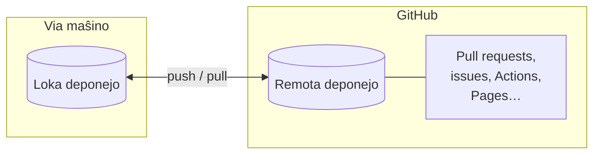

# Kio estas GitHub

[Git](../git/index.md) registras la historion de via projekto sur via propra
maŝino. **GitHub** estas retejo, kiu gastigas Git-deponejojn interrete kaj aldonas
sur ilin tavolon de kunlaboraj iloj: koda revizio, spurado de problemoj (issues),
aŭtomatigo kaj reta gastigado. Ĝi estas la loko, kie vivas hodiaŭ la plimulto de la
malfermkoda programaro — kaj granda parto de la privata programaro.

Ĉi tiu paĝo tiras la limon inter la du kaj klarigas kion aldonas la platformo.

## Git ne estas GitHub

Ĉi tiu estas la plej ofta fonto de konfuzo, do indas diri ĝin klare:

- **Git** estas *ilo*. Ĝi funkcias sur via komputilo, ne apartenas al iu, kaj
  funkcias sen retkonekto.
- **GitHub** estas *servo*. Ĝi estas firmao (posedata de Microsoft), kiu gastigas
  Git-deponejojn kaj konstruas funkciojn ĉirkaŭ ili.

Vi povas uzi Git sen iam ajn tuŝi GitHub-on. Vi ne povas uzi GitHub sen Git sube.
Kiam vi faras `git push`, GitHub estas simple unu ebla **remoto** — kunhavigita
kopio de la deponejo, kiun ankaŭ viaj kunlaborantoj povas atingi.

!!! tip "La mensa mallongigo"
    Git administras *versiojn*; GitHub administras *la kunlaboron ĉirkaŭ tiuj
    versioj*. Ĉio en GitHub — kunfanda peto, revizio, verda marko — estas finfine
    konversacio pri commit-oj kaj branĉoj kiujn kreis Git.

## Kion aldonas GitHub

Krom la nura gastigado de Git, GitHub provizas la funkciojn, kiuj igas la teaman
laboron praktika. Tiuj, kiujn uzas ĉi tiu gvidilo, estas:

- **Gastigado.** Centra, ĉiam disponebla remoto, al kiu ĉiuj povas puŝi kaj de kiu
  ĉiuj povas tiri — sen servilo, kiun vi mem administras.
- **Kunfandaj petoj (pull requests).** Strukturita maniero proponi ŝanĝon: "jen
  branĉo, bonvolu revizii ĝin antaŭ ol ĝi eniru `main`". Ĝi estas la koro de la
  [laborfluo](workflow.md).
- **Koda revizio.** Komentoj linio post linio, aproboj kaj petoj de ŝanĝoj sur
  kunfanda peto, por ke la ŝanĝojn kontrolu alia persono antaŭ ol ili eniru.
- **Problemoj (issues).** Spurilo por cimoj, taskoj kaj ideoj, ĉiu kun sia propra
  diskuto, etikedoj kaj ligiloj al la kunfandaj petoj, kiuj solvas ilin.
- **GitHub Actions.** Aŭtomatigo, kiu funkcias sur la serviloj de GitHub kiam io
  okazas — ekzemple, ruli viajn testojn ĉe ĉiu kunfanda peto. Traktata en
  [GitHub Actions](actions.md).
- **GitHub Pages.** Senpaga gastigado de statikaj retejoj servata rekte el deponejo
  — tiel publikiĝas la dokumentaro, kiun vi legas. Traktata en
  [GitHub Pages](pages.md).

Ĉiu el ĉi tiuj havas sian propran paĝon poste en la sekcio. Ĉi tiu sama deponejo,
`nlp-esperantilo`, uzas ĉiujn el ili, kaj estas referencata tra la tuta gvidilo kiel
viva ekzemplo.

## Alternativoj

GitHub estas la plej populara platformo de sia speco, sed ne la sola. La ĉefaj
alternativoj estas:

- **GitLab** — tre simila aro da funkcioj, disponebla kaj kiel gastigata servo kaj
  kiel programaro, kiun vi povas ruli sur via propra servilo.
- **Bitbucket** — la propono de Atlassian, ofte uzata kune kun Jira.
- **Memgastigataj opcioj** (ekz. **Gitea**, **Forgejo**) — malpezaj serviloj, kiujn
  vi mem rulas.

Kio gravas estas, ke ĉiuj envolvas **la saman Git sube**. La komandoj el la
[Git-sekcio](../git/index.md) funkcias idente kun ĉiu el ili; nur la retejo kaj ĝiaj
kromaj funkcioj diferencas. Lernu la laborfluon unufoje, kaj vi povos movi vin inter
platformoj kun malmulta frotado.

## Kien iri poste

- [Unuaj paŝoj](first-steps.md) — kreu konton kaj vian unuan deponejon.
- [Laborfluo](workflow.md) — la ĉiutaga ciklo branĉo → kunfanda peto → kunfando.
