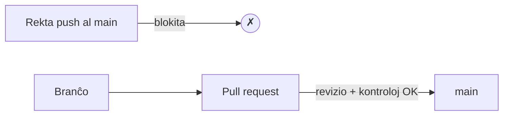

# Agordo de la deponejo

La [laborfluo](workflow.md) kaj la [Actions](actions.md) nur *helpas* se la teamo
vere sekvas ilin. Ĉi tiu paĝo temas pri igi ilin **devigaj**: agordi la deponejon
tiel, ke `main` ne povu esti rompita hazarde, kaj ke ĉiu ŝanĝo trairu reviziitan,
testitan kunfandan peton.

!!! info "La ordo gravas"
    Protekti `main` havas sencon nur post kiam ekzistas branĉoj, kunfandaj petoj kaj
    CI-kontroloj — tial ĉi tiu paĝo venas post [Laborfluo](workflow.md) kaj
    [GitHub Actions](actions.md). Agordu la regulojn kiam tiuj pecoj estas surloke.

## Protekto de branĉoj kaj regularoj (rulesets)

Defaŭlte, iu ajn kun skriba aliro povas puŝi rekte al `main`. **Regularo (ruleset)**
(la moderna anstataŭaĵo de la klasikaj *branch protection rules*) ŝlosas tion. En
**Settings → Rules → Rulesets → New branch ruleset**, celu la branĉon `main` kaj
aktivigu, minimume:

- **Restrict deletions** kaj **Block force pushes** — la historio de `main` ne povas
  esti forigita nek reskribita.
- **Require a pull request before merging** — neniuj rektaj puŝoj al `main`; ĉiu
  ŝanĝo alvenas kiel kunfanda peto.

Kun nur ĉi tiuj du, `main` estas sekura kontraŭ hazardaj rektaj commit-oj, kaj la
[laborfluo](workflow.md) fariĝas la *sola* enirvojo.

## Devigaj revizioj

Ene de la regulo "Require a pull request", metu **Require approvals** al almenaŭ
**1**. Nun kunfanda peto ne povas kunfandiĝi ĝis teamano revizios kaj aprobos ĝin —
la principo de kvar okuloj, altrudita.

Indas koni du rilatajn opciojn:

- **Dismiss stale approvals when new commits are pushed.** Se la aŭtoro puŝas pliajn
  ŝanĝojn post aprobo, la aprobo nuliĝas kaj la reviziinto devas rerigardi — do
  neniu kunfandas kodon, kiu neniam estis vere reviziita.
- **Require review from Code Owners.** Se vi aldonas dosieron `CODEOWNERS`, la
  ŝanĝojn en certaj vojoj devas aprobi iliaj difinitaj posedantoj.

## Devigaj statuskontroloj

Ĉi tie envenas la [Actions](actions.md). Aktivigu **Require status checks to pass
before merging**, kaj poste elektu la kontrolojn, kiuj devas esti verdaj — por ĉi
tiu deponejo, la **testoj**, la **ortografia kontrolo** kaj la **konstruo de la
dokumentaro**.

Kunfanda peto, kies kontroloj estas ruĝaj, tiam ne plu povas kunfandiĝi, negrave kiu
aprobas ĝin. La aŭtomataj kvalitaj pordoj kaj la homa revizio reciproke plifortigas
sin:

- la maŝino kaptas tion, kion la homoj preterlasas (malsukcesa testo, tajperaro,
  rompita ligilo);
- la homo kaptas tion, kion la maŝinoj preterlasas (malbona dezajno, malklara kodo,
  malĝusta aliro).

!!! tip "Postulu ankaŭ, ke la branĉo estu ĝisdata"
    La opcio **Require branches to be up to date before merging** devigas, ke
    kunfanda peto inkluzivu la plej lastan `main` antaŭ ol ĝi povas kunfandiĝi, por
    ke la kontroloj ruliĝis kontraŭ tio, kio fakte eniros — ne kontraŭ malaktuala
    bazo.

## Aliaj utilaj agordoj

Kelkaj pliaj agordoj tenas la deponejon ordigita, plejparte sub **Settings →
General** kaj la regularo:

- **Automatically delete head branches.** Post kunfando de kunfanda peto, ĝia branĉo
  foriĝas — sen mana purigo, sen malordo de mortintaj branĉoj.
- **Require linear history.** Malpermesas kunfandajn commit-ojn sur `main`, tenante
  la historion rekta linio (bone kunfunkcias kun *squash*-kunfandoj).
- **Require conversation resolution before merging.** Ĉiu revizia komento devas esti
  markita kiel solvita antaŭ ol malŝlosiĝas la kunfanda butono, por ke neniu komento
  estu silente forlasita.

## Bonaj praktikoj

La agordo altrudas regulojn, sed sana projekto ankaŭ dependas de kutimoj, kiujn la
agordoj ne povas kontroli:

- **Kunfandaj petoj kun bone verkitaj commit-oj.** Malgrandaj, atomaj commit-oj kun
  klaraj mesaĝoj (vidu
  [Laborfluo § Bonaj praktikoj de commit-oj](workflow.md#bonaj-praktikoj-de-commit-oj))
  igas la revizion rapida kaj la historion legebla.
- **Verda antaŭ la revizio.** Igu la kontrolojn sukcesaj antaŭ ol vi petas teamanon
  revizii — ne malŝparu ilian tempon je io, kion CI estus kaptinta.
- **Ekvilibra kontribuo.** En teama tasko, ĉiuj devus malfermi kunfandajn petojn kaj
  ĉiuj devus revizii ilin. La paĝo **Insights → Contributors** videbligas la
  ekvilibron (aŭ la malekvilibron).
- **Reviziu afable kaj konkrete.** Komentu pri la kodo, ne pri la persono; sugestu,
  ne nur rifuzu.

Kune, la altruditaj reguloj kaj ĉi tiuj kutimoj estas tio, kio permesas al teamo
moviĝi rapide *sen* rompi `main` nek paŝi sur la laboron unu de la alia.

## Kien iri poste

- [GitHub Pages](pages.md) — publikigi la dokumentaron el la deponejo.
