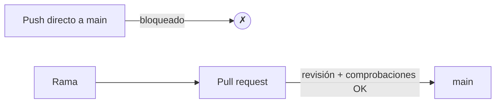

# Configuración del repositorio

El [flujo de trabajo](workflow.md) y las [Actions](actions.md) solo *ayudan* si el
equipo de verdad los sigue. Esta página trata de hacer que se **impongan**:
configurar el repositorio para que `main` no pueda romperse por accidente, y para
que cada cambio pase por un pull request revisado y probado.

!!! info "El orden importa"
    Proteger `main` solo tiene sentido una vez que existen ramas, pull requests y
    comprobaciones de CI — por eso esta página viene después de
    [Flujo de trabajo](workflow.md) y [GitHub Actions](actions.md). Configura las
    reglas cuando esas piezas ya estén en su sitio.

## Protección de ramas y rulesets

Por defecto, cualquiera con acceso de escritura puede hacer push directamente a
`main`. Un **ruleset** (el reemplazo moderno de las clásicas *branch protection
rules*) lo bloquea. En **Settings → Rules → Rulesets → New branch ruleset**,
apunta a la rama `main` y activa, como mínimo:

- **Restrict deletions** y **Block force pushes** — el historial de `main` no
  puede borrarse ni reescribirse.
- **Require a pull request before merging** — nada de pushes directos a `main`;
  cada cambio llega como un pull request.

Con solo estas dos, `main` queda a salvo de commits directos accidentales, y el
[flujo de trabajo](workflow.md) se convierte en la *única* vía de entrada.

## Revisiones obligatorias

Dentro de la regla "Require a pull request", pon **Require approvals** en al menos
**1**. Ahora un pull request no puede fusionarse hasta que un compañero lo haya
revisado y aprobado — el principio de los cuatro ojos, impuesto.

Vale la pena conocer dos opciones relacionadas:

- **Dismiss stale approvals when new commits are pushed.** Si el autor sube más
  cambios después de una aprobación, la aprobación se anula y quien revisa debe
  mirar de nuevo — así nadie fusiona código que en realidad nunca se revisó.
- **Require review from Code Owners.** Si añades un archivo `CODEOWNERS`, los
  cambios en ciertas rutas deben aprobarlos sus propietarios designados.

## Comprobaciones de estado obligatorias

Aquí es donde entran las [Actions](actions.md). Activa **Require status checks to
pass before merging**, y luego selecciona las comprobaciones que deben estar en
verde — para este repositorio, las **pruebas**, la **corrección ortográfica** y la
**construcción de la documentación**.

Un pull request cuyas comprobaciones están en rojo ya no puede fusionarse, sin
importar quién lo apruebe. Las puertas de calidad automatizadas y la revisión
humana se refuerzan mutuamente:

- la máquina detecta lo que se le escapa a los humanos (una prueba que falla, una
  errata, un enlace roto);
- el humano detecta lo que se le escapa a las máquinas (un mal diseño, código poco
  claro, un enfoque equivocado).

!!! tip "Exige también que la rama esté al día"
    La opción **Require branches to be up to date before merging** obliga a que un
    pull request incluya el `main` más reciente antes de poder fusionarse, de modo
    que las comprobaciones se ejecutaron contra lo que realmente va a entrar — no
    contra una base desactualizada.

## Otros ajustes útiles

Unos cuantos ajustes más mantienen el repositorio ordenado, en su mayoría bajo
**Settings → General** y el ruleset:

- **Automatically delete head branches.** Después de fusionar un pull request, su
  rama se elimina — sin limpieza manual, sin acumulación de ramas muertas.
- **Require linear history.** Prohíbe los commits de fusión en `main`, manteniendo
  el historial en línea recta (combina bien con las fusiones *squash*).
- **Require conversation resolution before merging.** Cada comentario de revisión
  debe marcarse como resuelto antes de que se desbloquee el botón de fusión, para
  que ningún comentario se descarte en silencio.

## Buenas prácticas

La configuración impone reglas, pero un proyecto saludable también depende de
hábitos que los ajustes no pueden comprobar:

- **Pull requests con commits bien escritos.** Commits pequeños y atómicos con
  mensajes claros (véase
  [Flujo de trabajo § Buenas prácticas de commit](workflow.md#buenas-practicas-de-commit))
  hacen la revisión rápida y el historial legible.
- **Verde antes de la revisión.** Consigue que las comprobaciones pasen antes de
  pedirle a un compañero que revise — no gastes su tiempo en algo que CI habría
  detectado.
- **Contribución equilibrada.** En un trabajo en equipo, todos deberían abrir pull
  requests y todos deberían revisarlos. La página **Insights → Contributors** hace
  visible el equilibrio (o el desequilibrio).
- **Revisa con amabilidad y concreción.** Comenta sobre el código, no sobre la
  persona; sugiere, no te limites a rechazar.

Juntos, las reglas impuestas y estos hábitos son lo que permite a un equipo
moverse rápido *sin* romper `main` ni pisarse el trabajo unos a otros.

## Adónde ir después

- [GitHub Pages](pages.md) — publicar la documentación desde el repositorio.
