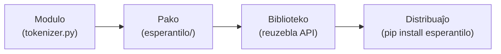

# Kio estas biblioteko

**Biblioteko** estas peco da kodo verkita por esti *reuzata* de alia kodo. Anstataŭ
kopii funkciojn inter projektoj, vi pakas ilin unufoje, donas al ili klaran publikan
interfacon, kaj lasas ke ajna projekto instalu kaj importu ilin. `esperantilo` — la
biblioteko, kiun konstruas ĉi tiu gvidilo — estas unu: regul-bazita NLP-ilaro por
Esperanto, kiun kajero povas instali kaj uzi en kelkaj linioj.

Ĉi tiu paĝo ordigas la vortprovizon, klarigas kion donas al vi biblioteko, kaj
rigardas konatan ekzemplon por imiti.

## Modulo, pako, biblioteko, distribuaĵo

Ĉi tiuj kvar vortoj ofte estas uzataj malprecize. En Python ili signifas specifajn
aferojn:

| Termino | Kio ĝi estas |
| --- | --- |
| **Modulo** | Unuopa dosiero `.py`. Importi ĝin rulas ĝin unufoje kaj eksponas ĝiajn nomojn. |
| **Pako** | *Dosierujo* de moduloj importata kiel unu unuo, kutime markita per `__init__.py`. |
| **Biblioteko** | Pako (aŭ aro da pakoj) celita por esti reuzata de alia kodo. |
| **Distribuaĵo** | La pakita artefakto, kiun vi instalas — kion `pip install` alportas. |

La progresio estas de skalo: **modulo** estas dosiero, **pako** grupigas modulojn en
dosierujon, **biblioteko** estas pako dezajnita por reuzo, kaj **distribuaĵo** estas
tiu biblioteko pakita por povi instaliĝi aliloke.



En ĉi tiu projekto, `src/esperantilo/` estas la **pako**, la API kiun ĝi eksponas
igas ĝin **biblioteko**, kaj `pyproject.toml` estas tio, kio igas ĝin instalebla
**distribuaĵo** (vidu [Organizado](organization.md)).

## Kion donas al vi biblioteko

Kial paki kodon anstataŭ nur teni `utils.py` proksime? Biblioteko donas al vi kvar
aferojn:

- **Reuzon.** Verku la Esperantan tokenizilon unufoje; importu ĝin de ĉiu kajero,
  skripto kaj testo sen kopii-kaj-alglui.
- **Stabilan interfacon.** La uzantoj dependas de la *publika* API, ne de la internaj
  detaloj. Vi povas reskribi la internaĵojn libere dum la interfaco tenas (pri tio
  temas [la API-paĝo](api.md)).
- **Versiadon.** La eldonoj estas numeritaj (`0.1.0`, `0.2.0`, …), do la uzantoj
  povas diri "mi bezonas version 0.1" kaj ricevi reprodukteblan konduton.
- **Distribuadon.** Unu sola komando `pip install` liveras la kodon kaj ĝiajn
  dependecojn al iu ajn, ie ajn — inkluzive de kajero en Google Colab.

## Konkreta ekzemplo

La plej klara maniero vidi kion signifas "bona biblioteko" estas uzi unu.
**scikit-learn** estas vaste uzata maŝinlernada biblioteko kaj modelo de agrabla
dezajno. Vi instalas ĝin unufoje:

```bash
pip install scikit-learn
```

importas etan, bone-nomitan pecon de ĝi:

```python
from sklearn.linear_model import LogisticRegression

model = LogisticRegression()
model.fit(X_train, y_train)      # trejni
predictions = model.predict(X_test)  # uzi
```

kaj vi estas produktiva tuj — sen legi ĝian fontkodon. Pri tio temas biblioteko.
Kio igas ĝin funkcii indas nomi, ĉar tiuj estas ekzakte la kvalitoj celendaj en
`esperantilo`:

- **Konsekvenca interfaco.** Preskaŭ ĉiu scikit-learn-taksilo havas la samajn
  metodojn `.fit()` / `.predict()`, do kiam vi lernas unu, vi povas diveni la
  aliajn.
- **Sencoplenaj defaŭltoj.** `LogisticRegression()` funkcias sen argumentoj; vi tuŝas
  parametrojn nur kiam vi bezonas.
- **Klaraj nomoj kaj dokumentado.** `fit`, `predict`, `LogisticRegression` diras kion
  ili faras, kaj ĉiu publika objekto havas dokumentadon.

La NLP-biblioteko **spaCy** — la dezajna referenco por la propra API de ĉi tiu
projekto — havas la samajn kvalitojn, aplikitajn al teksto. Ni revenas al ĝi detale en
[la API-paĝo](api.md).

## Kien iri poste

- [Organizado](organization.md) — la dosieroj kaj dosierujoj, kiuj transformas ĉi tiun
  kodon en instaleblan bibliotekon.
- [Instalado kaj uzo](installation-and-usage.md) — instali `esperantilo` de GitHub kaj
  uzi ĝin en kajero.
