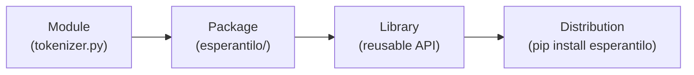

# What is a library

A **library** is a piece of code written to be *reused* by other code. Instead of
copying functions between projects, you package them once, give them a clear
public interface, and let any project install and import them. `esperantilo` —
the library this guide builds — is one: a rule-based NLP toolkit for Esperanto
that a notebook can install and use in a couple of lines.

This page sorts out the vocabulary, explains what a library buys you, and looks
at a well-known example to imitate.

## Module, package, library, distribution

These four words are often used loosely. In Python they mean specific things:

| Term | What it is |
| --- | --- |
| **Module** | A single `.py` file. Importing it runs it once and exposes its names. |
| **Package** | A *folder* of modules imported as one unit, normally marked by an `__init__.py`. |
| **Library** | A package (or set of packages) meant to be reused by other code. |
| **Distribution** | The packaged artifact you install — what `pip install` fetches. |

The progression is one of scale: a **module** is a file, a **package** groups
modules into a folder, a **library** is a package designed for reuse, and a
**distribution** is that library bundled up so it can be installed elsewhere.



In this project, `src/esperantilo/` is the **package**, the API it exposes makes
it a **library**, and `pyproject.toml` is what turns it into an installable
**distribution** (see [Organization](organization.md)).

## What a library gives you

Why package code instead of just keeping a `utils.py` around? A library gives
you four things:

- **Reuse.** Write the Esperanto tokenizer once; import it from every notebook,
  script and test without copy-pasting.
- **A stable interface.** Users depend on the *public* API, not on the internal
  details. You can rewrite the internals freely as long as the interface holds
  (this is what [the API page](api.md) is about).
- **Versioning.** Releases are numbered (`0.1.0`, `0.2.0`, …), so users can say
  "I need version 0.1" and get reproducible behaviour.
- **Distribution.** A single `pip install` command delivers the code and its
  dependencies to anyone, anywhere — including a Google Colab notebook.

## A concrete example

The clearest way to see what "a good library" means is to use one. **scikit-learn**
is a widely used machine-learning library and a model of pleasant design. You
install it once:

```bash
pip install scikit-learn
```

import a small, well-named piece of it:

```python
from sklearn.linear_model import LogisticRegression

model = LogisticRegression()
model.fit(X_train, y_train)      # train
predictions = model.predict(X_test)  # use
```

and you are productive immediately — without reading its source code. That is
the whole point of a library. What makes it work is worth naming, because these
are exactly the qualities to aim for in `esperantilo`:

- **A consistent interface.** Almost every scikit-learn estimator has the same
  `.fit()` / `.predict()` methods, so once you learn one, you can guess the
  others.
- **Sensible defaults.** `LogisticRegression()` works with no arguments; you
  only touch parameters when you need to.
- **Clear names and documentation.** `fit`, `predict`, `LogisticRegression` say
  what they do, and every public object has documentation.

The NLP library **spaCy** — the design reference for this project's own API —
has the same qualities, applied to text. We return to it in detail on
[the API page](api.md).

## Where to go next

- [Organization](organization.md) — the files and folders that turn this code
  into an installable library.
- [Installation and usage](installation-and-usage.md) — installing `esperantilo`
  from GitHub and using it in a notebook.
